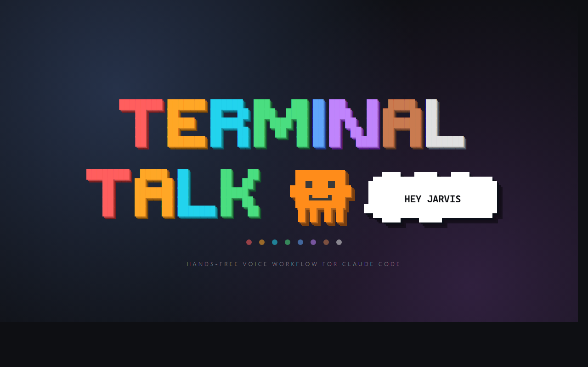
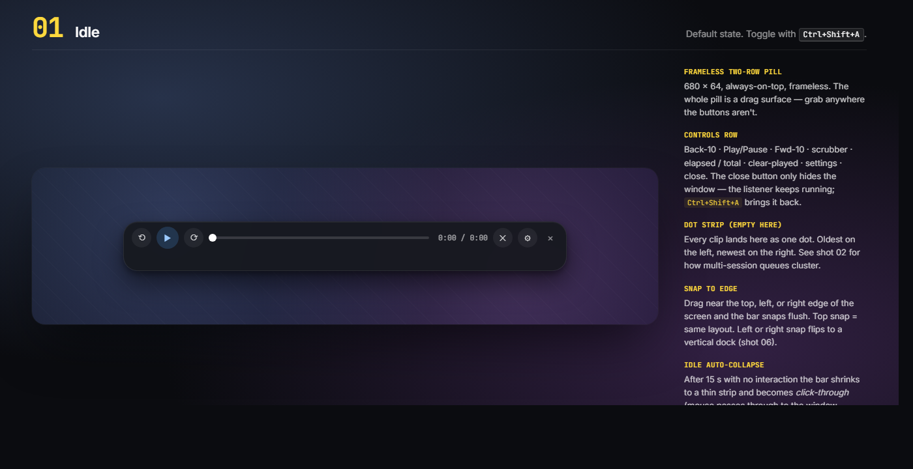
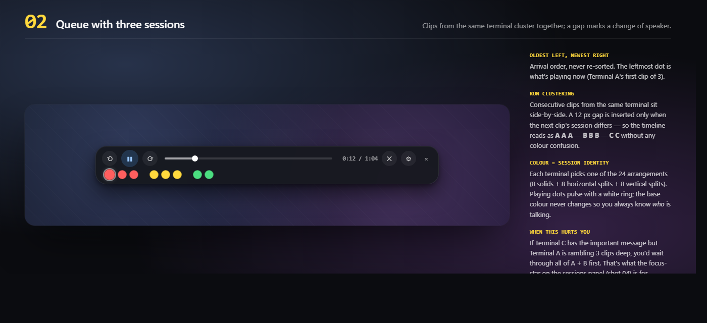
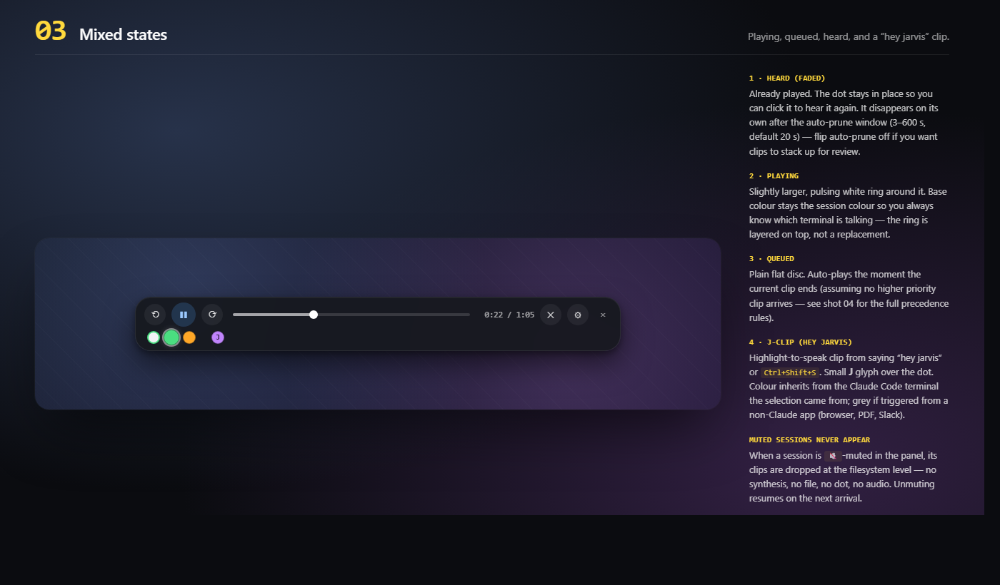
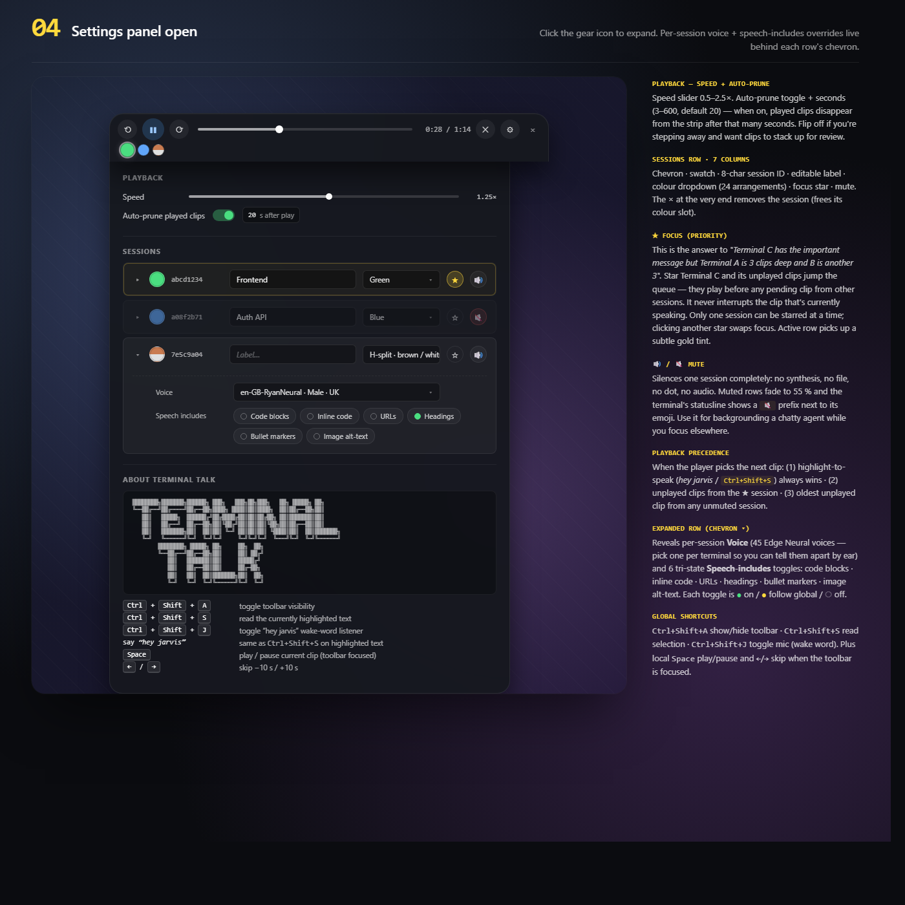
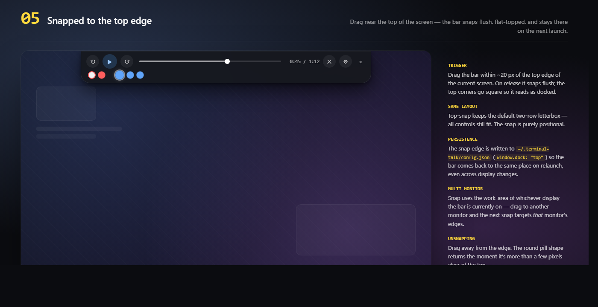
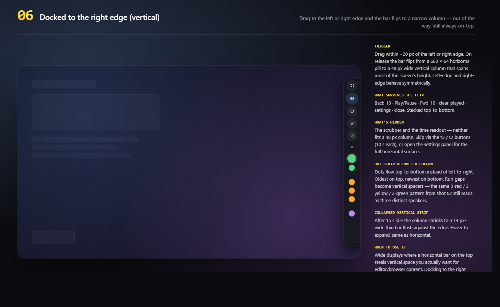

<p align="center">
  
</p>

<p align="center">
  <a href="https://github.com/benfrancisburns-creator/terminal-talk/releases/latest"></a>
  <a href="LICENSE"></a>
  
  
  <a href="https://github.com/benfrancisburns-creator/terminal-talk/actions/workflows/test.yml"></a>
</p>

**Hands-free voice workflow for Claude Code.**
Claude's replies are read aloud. Highlight any text anywhere, say _"hey jarvis"_, hear it.
Pair with [Wispr Flow](https://wisprflow.ai/) (or any speech-to-text tool) and you can run entire Claude Code sessions without touching the keyboard.

Free by default — uses Microsoft Edge's neural voices and offline wake-word detection. **Zero accounts required.** Optional OpenAI fallback if you want it.

Windows-only for now; Mac/Linux planned.

[Install](#install-windows) · [Usage](#usage) · [Per-session controls](#per-session-overrides) · [Privacy](#privacy--security) · [Tests](#tests) · [Contributing](CONTRIBUTING.md)

---

## What you get

| | |
|---|---|
| **Streaming auto-speak** | Claude's responses are spoken aloud as they're written. Audio starts ~2-3 seconds after Claude begins (not 6-24 seconds after the turn ends) because sentences synthesise in parallel and a `PreToolUse` hook fires mid-response whenever Claude is about to use a tool. Questions are extracted and spoken first so you hear the ask upfront. |
| **Highlight-to-speak, anywhere** | Select text in any app (browser, PDF, VS Code, Slack), say _"hey jarvis"_ or press `Ctrl+Shift+S`, hear it read. |
| **Permission-prompt alerts** | When Claude Code asks to use a tool, a voice notification fires so you don't have to watch the screen. |
| **Floating audio toolbar** | Always-on-top two-row letterbox: controls on top (play/pause, scrubber, time, clear, settings), dots on the bottom strip (~30 visible). Drag to any screen edge and it snaps flush. Left/right edges switch to a vertical column layout. After 15 s of no interaction it shrinks to a thin strip and becomes click-through; hover to re-expand. |
| **Per-terminal identity (3 axes)** | Each Claude Code terminal gets a unique **dot colour** on the toolbar, **emoji in its statusline**, and optionally its **own voice**. Open 5+ terminals and you can tell them apart at a glance — or by ear if you set distinct voices. Sessions persist until you explicitly remove them (× button on each row of the Sessions table). |
| **Per-session mute** | `🔊/🔇` button on each Sessions table row. Muted sessions skip edge-tts entirely (no synthesis, no clips, no audio) and show a `🔇` prefix in the terminal's statusline. Perfect for backgrounding chatty terminals. |
| **Focus mode (priority)** | Star `☆ → ★` button on each Sessions row. When Terminal 2 is the one that matters and Terminal 3 is rambling 15 clips deep, starring T2 makes its clips jump the queue — they play before any other session's pending clip (no interruption of the clip currently playing). Only one session can be focused at a time; clicking another star swaps focus. Highlight-to-speak clips still win over everything. |
| **Per-session speech-includes** | Override what gets spoken on a per-terminal basis: code blocks, inline code, URLs, headings, bullet markers, image alt-text. |
| **Auto-prune** | Played clips disappear after a configurable delay (default 20 s, range 3-600 s, toggle on/off). Walking away? Flip it off and let clips stack up for when you're back. |
| **Tap to mute the mic** | `Ctrl+Shift+J` toggles the wake-word listener (chime confirms). Mic is truly released when off — orphan-swept + state-file-driven stream teardown. |

## UI states

Six annotated mocks rendered from [`docs/design-system/mocks-annotated.html`](docs/design-system/mocks-annotated.html) — open that page directly for the live interactive version with every annotation visible on the right-hand side.

### 01 · Idle

<p align="center">
  
</p>

The baseline. 680 × 64 frameless two-row pill, always-on-top, drag anywhere to move. Close just hides the window — the listener keeps running and `Ctrl+Shift+A` brings it back.

### 02 · Queue with three sessions

<p align="center">
  
</p>

Three terminals queued in arrival order: **3 red** from Terminal A (first one playing, 2 queued behind), **3 yellow** from Terminal B, **2 green** from Terminal C. The 12 px gap between runs marks a change of speaker so the timeline reads as **A A A — B B B — C C** at a glance. Oldest left, newest right, never re-sorted. If Terminal C has the important message you'd wait through 5 clips first — that's the story shot 04's focus-star solves.

### 03 · Mixed states

<p align="center">
  
</p>

**Heard** (already played, auto-prunes after 3–600 s, click to replay, right-click to delete) · **Playing** (pulsing white ring around the session colour) · **Queued** (flat disc, auto-plays when current ends) · **J-clip** — a highlight-to-speak capture from "hey jarvis" / `Ctrl+Shift+S`. Muted sessions never appear here at all.

### 04 · Settings panel open

<p align="center">
  
</p>

The gear reveals three sections. **Playback** — speed 0.5–2.5× + auto-prune toggle (off = clips stack up for review). **Sessions** — every active terminal in a 7-column row: chevron · swatch · 8-char ID · editable label · colour dropdown (24 arrangements) · focus ★ · mute 🔊/🔇. The chevron reveals per-session voice (45 Edge voices — pick different voices so you can tell terminals apart by ear) and six tri-state speech-includes toggles. **About** has the ASCII banner + full shortcuts.

**Playback precedence** — (1) "hey jarvis" / `Ctrl+Shift+S` highlight-to-speak always wins · (2) unplayed clips from the focused ★ session jump the queue · (3) oldest unplayed clip from any unmuted session. That's how you make Terminal C's important reply play before Terminal A's 3-deep ramble.

### 05 · Snapped to the top edge

<p align="center">
  
</p>

Drag within ~20 px of the top edge and the bar snaps flush on release. Top corners flatten so it reads as docked. Same two-row letterbox — all controls still fit. The snap edge is persisted in `~/.terminal-talk/config.json` so it comes back to the same place on relaunch, on whichever monitor you left it.

### 06 · Docked to the right edge (vertical)

<p align="center">
  
</p>

Drag to the left or right edge and the bar flips to a narrow 48 px column running most of the screen's height — out of the way, still always-on-top. Back-10 · Play · Fwd-10 · clear · settings · close stack vertically. The scrubber and time readout are hidden (they don't fit); open the panel if you need to scrub. Dots flow top-to-bottom, oldest on top, run-gaps become vertical spacers. Best for wide monitors where a top bar steals vertical space from the editor.

## Who it's for

- **Claude Code users** working in the terminal who want responses read aloud (primary).
- **Anyone** who wants a fast "select text, hear it" keystroke — no agent required.
- **Voice-first workflows** — combine with a speech-to-text tool and you barely touch the keyboard.

### Speech-to-text pairings (not bundled)

| Tool | Platform | Cost | Notes |
|---|---|---|---|
| [Wispr Flow](https://wisprflow.ai/) | Win/Mac | Paid | Best quality. |
| [Talon Voice](https://talonvoice.com/) | Win/Mac/Linux | Free | Powerful, steeper learning curve. |
| Windows Voice Access | Windows 11 | Free, built-in | Settings → Accessibility → Voice access. |

---

## Install (Windows)

**Requirements:** Python 3.10+, Node.js 18+, a working microphone.

```powershell
git clone https://github.com/benfrancisburns-creator/terminal-talk
cd terminal-talk
.\install.ps1
```

The installer:
1. Checks Python and Node versions.
2. Pip-installs `edge-tts`, `openwakeword`, `onnxruntime`, `sounddevice`, `numpy`.
3. Pre-downloads the `hey_jarvis` wake-word model (~30 MB, one-time).
4. `npm install`s Electron.
5. Copies everything to `%USERPROFILE%\.terminal-talk\`.
6. Asks if you want to register Claude Code hooks (recommended).
7. Asks if you want the per-terminal coloured emoji statusline.
8. Asks if you want Terminal Talk to auto-launch at login.

Re-running `install.ps1` is safe — it updates in place and preserves your `config.json` and session colour assignments.

---

## Usage

### Hotkeys

| Shortcut | Action |
|---|---|
| `Ctrl+Shift+A` | Show / hide the toolbar |
| `Ctrl+Shift+S` | Read the highlighted text |
| `Ctrl+Shift+J` | Toggle wake-word listening (chime confirms on/off) |
| Say "hey jarvis" | Same as `Ctrl+Shift+S` on highlighted text |

### Wake word

Highlight text, say **"hey jarvis"**, hear it. The 30 MB model lives in `~/.terminal-talk/...` and runs entirely on CPU — no audio leaves your machine for wake-word detection.

Want a different wake word? Edit `WAKE_WORDS` in `~/.terminal-talk/app/wake-word-listener.py`. openWakeWord ships `hey_mycroft`, `hey_rhasspy`, `alexa`, `timer`, `weather`.

### The toolbar UI

```
╭──────────────────────────────────────────────────────────────────╮
│  ◀◀10  [▶]  10▶▶   ●━━━━━━━○━━━━━━━━━  1:23 / 2:10  🗑  ⚙  ✕   │  ← controls
│  ● ● ● | ● ● | ● ● ● ● ● ●                                       │  ← dot strip
╰──────────────────────────────────────────────────────────────────╯
                           ↑        ↑
                 run gap  —  different terminal
 • Oldest (plays first) on the left; newest on the right
 • Gaps between runs show which terminal spoke when
 • Idle 15 s → shrinks to a thin strip; hover to expand
```

- Each dot = one audio clip in the queue.
- **Dot colour = session colour** (matches the emoji at the bottom of that terminal). Muted sessions don't show dots at all.
- **Clips autoplay the moment they land.** Auto-prune clears played clips after 20 s by default (configurable 3-600 s, or toggle off if you're stepping away).
- **Currently playing** dot glows with a white pulsing halo (same size as the others — no layout jump).
- **Click** a dot to (re)play it manually. **Right-click** to delete immediately.
- Clips for "hey jarvis" / `Ctrl+Shift+S` carry a small **J** label so you can tell them from auto-spoken Claude responses.
- Up to ~30 dots visible; beyond that the oldest drop off.
- **Drag the toolbar** to any screen edge and it snaps flush. Left/right edges switch to a vertical column. Position is saved.

### Settings panel (gear icon)

Click the gear to expand the toolbar into a panel with:

- **Playback** — speed slider (0.5×–2.5×).
- **Sessions** — one row per active Claude Code session:
  - Coloured swatch + 8-character session ID.
  - Editable label (shows next to the emoji in that terminal's statusline).
  - **Colour dropdown** — 24 arrangements: 8 solid colours + 8 horizontal splits + 8 vertical splits, with complementary colour pairings on the splits so each is unambiguous. Pick anything; the change is instant on the toolbar and propagates to the statusline within a couple of seconds.
  - **Chevron** — expands to per-session voice and speech-includes overrides (see below).
- **About Terminal Talk** — banner + shortcuts cheat-sheet.

### Per-session overrides

Click the chevron on any session row to expand its per-session controls:

- **Voice for this session** — pick any of the 45 verified Edge TTS English voices. Two terminals open? Give them different voices and you'll _hear_ which one spoke without even looking. Leave on _"follow global default"_ to use the main voice.
- **Speech includes overrides** — six tri-state toggles per session:

  | Toggle | What it controls |
  |---|---|
  | Code blocks | ` ```code``` ` blocks (content kept, fences and language tag stripped) |
  | Inline code | `` `code` `` spans (content kept, backticks stripped) |
  | URLs | bare `https://…` links |
  | Headings | `# Heading` lines |
  | Bullet markers | `- item` / `1. item` prefixes |
  | Image alt-text | `` alt attribute |

  Each toggle is **Default** (follow global), **On** (always speak), or **Off** (always skip). Saved to the session entry in `~/.terminal-talk/session-colours.json` and applied on the next turn — no restart needed.

### How session colours work

When a Claude Code terminal first interacts with Terminal Talk, the Stop hook (or statusline) registers it with the **lowest free colour index** in `~/.terminal-talk/session-colours.json`. The same hash informs both:

- The emoji at the bottom of the terminal (via Claude Code statusline).
- The dot colour on the toolbar.
- The colour of the **J** label on highlight-to-speak clips originating from that terminal.

Sessions only release their colour when the Claude Code process actually closes (and a 4-hour grace period elapses to absorb stale-PID windows). You can also pin a colour manually via the Sessions table dropdown — pinned colours never get reassigned.

When a "hey jarvis" / `Ctrl+Shift+S` fires from somewhere outside a Claude Code terminal (browser, PDF), the J dot renders **neutral grey**. From inside a Claude Code terminal, it inherits that terminal's colour.

---

## Three tiers

### 🆓 Free (default)

- **Wake word**: [openWakeWord](https://github.com/dscripka/openWakeWord) — MIT, offline, runs on CPU.
- **TTS**: [edge-tts](https://github.com/rany2/edge-tts) — Microsoft Edge's neural voices (45 verified English voices across UK, US, AU, IE, CA, IN, NZ, ZA, HK, SG, PH, NG, KE, TZ).
- No accounts. No API keys.

### 💳 Premium fallback (optional)

Add an [OpenAI API key](https://platform.openai.com/api-keys) and Terminal Talk falls back to OpenAI TTS (`onyx`, `shimmer`, etc.) whenever edge-tts has a network wobble. ~$0.015 per 1,000 characters.

Set via any of:
- `~/.terminal-talk/config.json`: `"openai_api_key": "sk-..."`
- Environment variable: `OPENAI_API_KEY=sk-...`
- `~/.claude/.env`: existing Claude Code setup is auto-detected

### 🎙️ Voice-in + voice-out (bonus)

Install a speech-to-text tool from the table above. Say _"Claude, refactor this function"_ → Claude Code processes → Terminal Talk reads the answer back. Fully hands-free.

---

## Configuration

`~/.terminal-talk/config.json` (created on first install, preserved on re-install):

```json
{
  "voices": {
    "edge_clip":      "en-GB-SoniaNeural",
    "edge_response":  "en-GB-RyanNeural",
    "openai_clip":    "shimmer",
    "openai_response": "onyx"
  },
  "hotkeys": {
    "toggle_window":    "Control+Shift+A",
    "speak_clipboard":  "Control+Shift+S",
    "toggle_listening": "Control+Shift+J"
  },
  "playback": { "speed": 1.25 },
  "speech_includes": {
    "code_blocks":    false,
    "inline_code":    false,
    "urls":           false,
    "headings":       true,
    "bullet_markers": false,
    "image_alt":      false
  },
  "openai_api_key": null
}
```

Per-session overrides live in `~/.terminal-talk/session-colours.json` (managed by the toolbar UI, but you can edit by hand). Each session entry can have an optional `voice` and an optional `speech_includes` partial:

```json
{
  "assignments": {
    "abcd1234": {
      "index": 3,
      "label": "Frontend",
      "pinned": true,
      "voice": "en-US-AriaNeural",
      "speech_includes": { "code_blocks": true, "urls": false }
    }
  }
}
```

Restart the toolbar after editing config.json by hand:
```powershell
taskkill /F /IM terminal-talk.exe
wscript "$env:APPDATA\Microsoft\Windows\Start Menu\Programs\Startup\terminal-talk.vbs"
```

---

## Privacy & Security

What Terminal Talk does:

| Action | Where it goes | Why |
|---|---|---|
| Wake-word detection | **Local only** (CPU, no network) | openWakeWord runs entirely offline. Audio is processed in-process and discarded. |
| TTS synthesis (free) | `speech.platform.bing.com` (Microsoft Edge TTS service) | The text being spoken is sent to Microsoft. Same endpoint Edge uses for "Read aloud." |
| TTS synthesis (premium) | `api.openai.com/v1/audio/speech` | Only if you've configured an OpenAI key. The text being spoken is sent to OpenAI. |
| Audio file storage | `~/.terminal-talk/queue/` | Local mp3/wav files. Auto-deleted 90s after manual play, or capped at 20 clips. |
| Session registry | `~/.terminal-talk/session-colours.json` + `~/.terminal-talk/sessions/<pid>.json` | Local-only. Tracks colour assignments and a short-lived per-PID file used to map foreground window → session. |
| Logs | `~/.terminal-talk/queue/_*.log` | Local-only diagnostic logs (toolbar, hook, voice listener). |
| Clipboard | Read locally during "hey jarvis" capture | Never sent anywhere except as TTS input above. |

What Terminal Talk does **not** do:
- No telemetry, analytics, error reporting, or "phone home" — anywhere in the codebase.
- No cloud account required (the free tier).
- No background recording or transcription. The wake-word listener processes 80 ms audio chunks locally and discards them.
- No modification of files outside `~/.terminal-talk/` and (if you opt in to hooks) `~/.claude/settings.json` (with backup).

**Permissions Terminal Talk needs:**
- Microphone access (for wake word).
- Network access to `speech.platform.bing.com` (TTS) and optionally `api.openai.com`.
- Read/write to `~/.terminal-talk/`.
- Write to `~/.claude/settings.json` (only at install/uninstall, with timestamped backup).
- Send Ctrl+C and Ctrl+Shift+S keystrokes to the foreground window (used to capture highlighted text after wake word).

---

## Tests

A 75-test harness exercises the actual installed components:

```powershell
node terminal-talk/scripts/run-tests.cjs --verbose
```

Coverage:

- Palette: 24 arrangements all distinct, edge cases (wrap, negatives).
- Filename parsing: response, question, notification, clip (session-scoped + neutral).
- Statusline assignment: lowest-free-index, two distinct sessions get different colours, returning sessions keep their slot, label appended to emoji.
- Edge TTS wrapper: produces real mp3 from text input.
- Speech-includes (`stripForTTS`): 9 toggle behaviours including content preservation when "On".
- Voice list validation: every Edge voice in the dropdown actually exists in Microsoft's catalogue, defaults are valid.
- Per-session merge: 5-row truth table (true/false/null/missing/empty).
- Registry handling: no UTF-8 BOM written, BOM tolerance on read, voice + speech_includes + muted flag preserved through round-trip writes.
- Sentence splitter: abbreviation / URL / decimal protection, paragraph-break boundaries, short-merge, hard-split on over-long sentences.
- synth_turn orchestrator: transcript extraction, tool_use filtering, sanitisation with code_blocks toggle, questions-first extraction, sync state round-trip, mute skip.
- Pinned sessions: not pruned even if PID dead and `last_seen` stale.
- Install sanity: required files present, config parses.

Tests are isolated from the live install — they use a tmp registry path so they can't race with your running statusline.

See [CONTRIBUTING.md](CONTRIBUTING.md) for adding new tests.

---

## How it works

```
                 "hey jarvis"                  highlight + Ctrl+Shift+S
                      │                                 │
                      ▼                                 │
         ┌───────────────────────┐                      │
         │  wake-word-listener   │  openWakeWord, CPU   │
         │       (Python)        │                      │
         └──────────┬────────────┘                      │
                    │ ctypes: Ctrl+Shift+S              │
                    ▼                                   ▼
         ┌─────────────────────────────────────────────────┐
         │  Electron main (globalShortcut)                  │
         │   ├─ sendCtrlC (via long-lived Python helper)    │
         │   ├─ poll clipboard for selection                │
         │   ├─ detectActiveSession (Win32 GetForeground +  │
         │   │     process tree walk, falls back to "most   │
         │   │     recently active session")                │
         │   ├─ stripForTTS (honours speech_includes)       │
         │   ├─ edge-tts (free, primary)                    │
         │   └─ fallback: OpenAI TTS                        │
         └─────────────────────────────────────────────────┘
                    │
                    ▼ writes .mp3/.wav
         ┌──────────────────────────┐
         │  ~/.terminal-talk/queue  │  fs.watch → renderer
         └──────────┬───────────────┘
                    ▼
         Floating toolbar autoplays, marks dot, auto-deletes after 90s

         Claude Code Stop hook (PowerShell) writes audio files into the same queue
         using the session's resolved voice and merged speech_includes.

         Claude Code statusline (PowerShell) reads the colour registry and emits
         the matching emoji + label per terminal.
```

The hook is the **single source of truth** for session colour assignment. The statusline reads the registry. The Electron main process reads the registry. No three-way race; one writer (with a fallback in the toolbar for sessions that haven't yet had a hook fire).

---

## Troubleshooting

| Symptom | Fix |
|---|---|
| Wake word not detected | Check mic in Windows Sound settings. `tail ~/.terminal-talk/queue/_voice.log` for heartbeat scores (~0 = silence, ≥0.5 = fire). |
| Nothing plays after "hey jarvis" | `tail ~/.terminal-talk/queue/_toolbar.log`. Common cause: edge-tts network wobble + no OpenAI fallback key. |
| Mic locked on, draining battery | `Ctrl+Shift+J` to stop the listener (high chime = on, low chime = off). |
| Hook not firing in Claude Code | Verify `~/.claude/settings.json` `Stop` hook command points to `$env:USERPROFILE\.terminal-talk\hooks\speak-response.ps1`. |
| Clipboard stays empty after "hey jarvis" | Some apps (very few) don't respond to programmatic Ctrl+C. Try a different app or `Ctrl+Shift+S` manually. |
| Dropdown text invisible (white-on-white) | Indicates Electron's `nativeTheme.themeSource` didn't apply on your build. Reinstall to update. |
| Two terminals on the same colour | Run `node terminal-talk/scripts/run-tests.cjs` — if statusline tests fail, edge-tts service is unreachable. If they pass, restart both terminals. |

---

## Uninstall

```powershell
.\uninstall.ps1
```

Stops running processes (only those in `~/.terminal-talk/`), removes the Startup shortcut, strips Terminal Talk hooks from `~/.claude/settings.json` (with timestamped backup), optionally deletes `~/.terminal-talk/`.

---

## Credits

- [openWakeWord](https://github.com/dscripka/openWakeWord) — offline wake-word detection (MIT)
- [edge-tts](https://github.com/rany2/edge-tts) — Microsoft Edge TTS wrapper (LGPL-3.0)
- [Electron](https://www.electronjs.org/) — the floating toolbar runtime (MIT)
- Wake-word model `hey_jarvis_v0.1` © openWakeWord contributors

## License

MIT. See [LICENSE](LICENSE).

Contributions welcome — Mac and Linux ports especially. See [CONTRIBUTING.md](CONTRIBUTING.md).
