<p align="center">
  
</p>

<p align="center">
  <a href="https://github.com/benfrancisburns-creator/terminal-talk/releases/latest"></a>
  <a href="LICENSE"></a>
  
  
  
  <a href="https://github.com/benfrancisburns-creator/terminal-talk/actions/workflows/test.yml"></a>
</p>

> **Status: v0.6 beta · solo-maintained.** Works well on Windows, covered by a large unit harness plus 39 Playwright E2E tests, but this is still an early widely-shared release — expect rough edges. Issues and PRs welcome. **Mac and Linux ports are in progress** — POSIX install paths and shared hook handlers are already in the repo (`install.sh`, `app/posix_hooks.py`); the remaining Windows-only bits are the highlight-to-speak key helper and the WMI mic-watcher. Mac is the next platform target. File bugs via [private Security Advisories](https://github.com/benfrancisburns-creator/terminal-talk/security/advisories/new) (security) or [public Issues](https://github.com/benfrancisburns-creator/terminal-talk/issues) (everything else).

**Terminal Talk turns Claude Code, Codex CLI, Claude Desktop Code, and Codex Desktop output into one colour-coded audio workstream.**

It is the voice-output half of a hands-free coding workflow: your assistants can keep working in separate terminal or desktop sessions while Terminal Talk speaks replies, tool progress, heartbeat state, and selected text through one local toolbar. Every source feeds the same queue, transcript, voice pipeline, focus controls, and 24-entry colour registry.

Windows first. Free by default. MIT licensed. No account required. Microsoft Edge TTS provides the free voices; openWakeWord handles local wake-word detection; optional OpenAI TTS is explicit and encrypted.

**Try it in your browser (no install):** [live interactive toolbar demo](https://benfrancisburns-creator.github.io/terminal-talk/ui-kit/) · [project landing page](https://benfrancisburns-creator.github.io/terminal-talk/)

[Install](#install-windows) · [Technical overview](#technical-overview) · [Current UI](#current-toolbar-and-settings-states) · [Assistant matrix](#assistant-support-matrix) · [Settings reference](#settings-panel-gear-icon) · [Architecture](#how-it-works) · [Privacy](#privacy--security) · [Changelog](CHANGELOG.md) · [Contributing](CONTRIBUTING.md)

## Technical overview

Terminal Talk is deliberately small in concept: inputs create clips, clips enter a local queue, the Electron toolbar plays them back with session identity.

| Layer | What it does | Main local state |
|---|---|---|
| Assistant inputs | Claude Code hooks/transcript watcher, Codex hooks/rollout watcher, Claude Desktop Code and Codex Desktop identity sync, highlight-to-speak capture | `~/.claude/settings.json`, `~/.codex/hooks.json`, desktop app local metadata where exposed |
| Text processing | Extracts assistant body text, tool progress, questions, footer verbs, and selected text; strips Markdown according to global/session policy | `app/synth_turn.py`, `app/lib/text.js`, `app/lib/codex-session-watcher.js` |
| Audio pipeline | Generates Edge or OpenAI TTS clips, queues body/tool/heartbeat/highlight clips, applies focus/mute/auto-prune rules | `~/.terminal-talk/queue/` |
| Session registry | Assigns the label, palette, voice, mute, focus, heartbeat, and speech-includes policy for each assistant session | `~/.terminal-talk/session-colours.json`, `~/.terminal-talk/sessions/*.json` |
| UI shell | Always-on-top toolbar, collapsed waveform letterbox, transcript, tabbed settings, tray, hotkeys, and reload path | Electron app under `~/.terminal-talk/app/` |

## Feature map

| Area | User-facing capability | Technical detail |
|---|---|---|
| Auto-speak | Claude and Codex replies become spoken clips without copy/paste | Claude uses `UserPromptSubmit`, `PreToolUse`, `Stop`, and transcript watching. Codex uses native hooks plus `~/.codex/sessions` rollout events. |
| Tool narration | Long tool chains speak progress like "Running the tests" | Claude gets semantic hook narration; Codex gets rollout-derived shell and patch progress clips where available. |
| Session identity | Every assistant gets a visible and audible identity | 24 palette arrangements: 8 solid colours, 8 top/bottom splits, 8 left/right splits. Labels, voices, focus, mute, heartbeat, and speech rules live in the shared registry. |
| Desktop sync | Persistent desktop chats can carry Terminal Talk identity | Claude Desktop Code and Codex Desktop rows expose sync status/actions when their local title metadata can be written. Renderer refresh timing is app-dependent. |
| Playback control | Focus one session, replay clips, prune heard audio, inspect transcripts | The queue keeps body clips, ephemeral tool clips, heartbeat clips, and priority `J` highlight clips separate. |
| Collapsed mode | The toolbar can shrink to a short waveform strip | The letterbox flashes only for the clip actually speaking and preserves solid, left/right, and top/bottom palette orientation. |
| Highlight-to-speak | Read selected text from any app | `Ctrl+Shift+S` or "hey jarvis" captures the foreground selection locally, then routes it through the same TTS and queue path. |
| Privacy | No telemetry and no cloud wake-word path | Wake-word audio stays local. Spoken text goes to Microsoft Edge TTS by default, or OpenAI only if configured. |

## Current toolbar and settings states

These are fresh captures from the live Electron toolbar mirror, not hand-built mockups. The first two rows show playback and collapsed states; the final two rows show the settings bar opened from the gear.

| Resting playback surface | Transcript panel expanded |
|---|---|
| 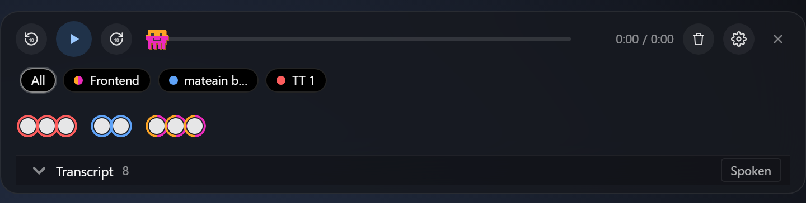 | 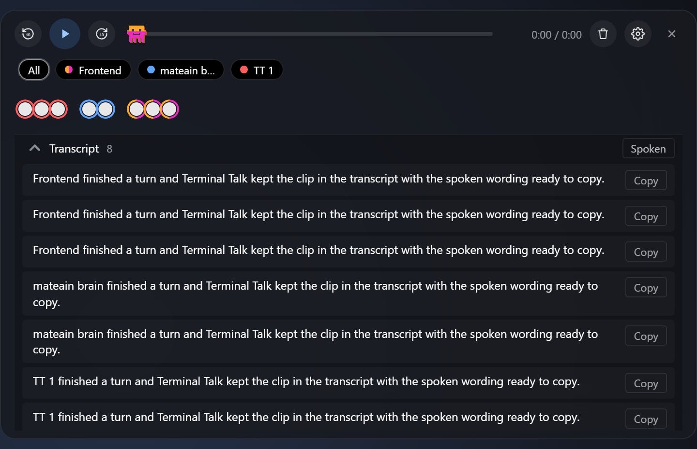 |

| Collapsed at rest | Collapsed while a split-palette session is speaking |
|---|---|
| 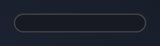 | 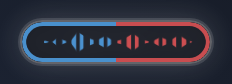 |

| Settings tabs overview | Sessions tab with per-session controls |
|---|---|
| 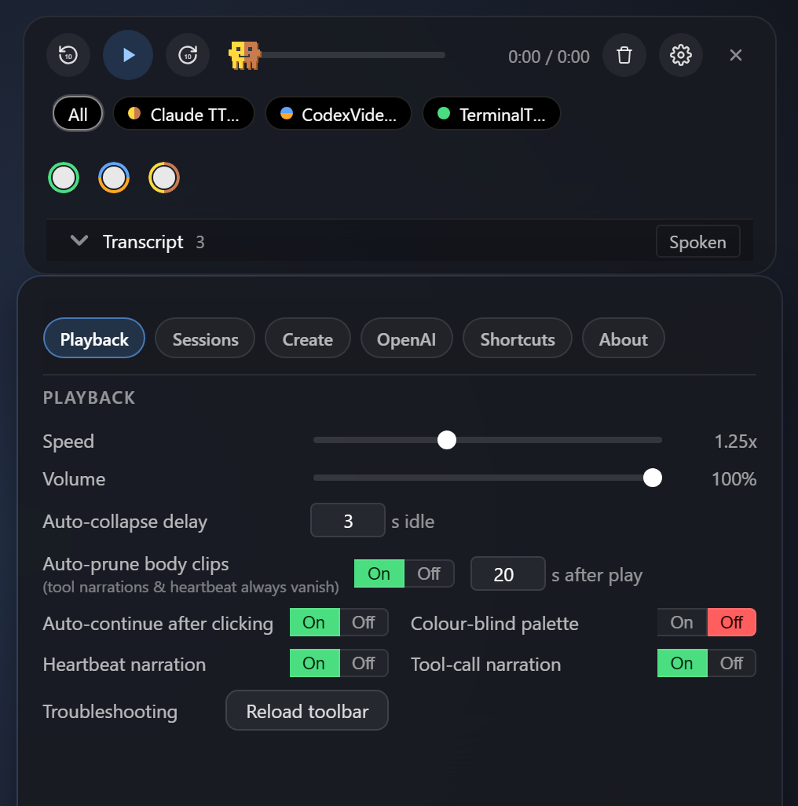 | 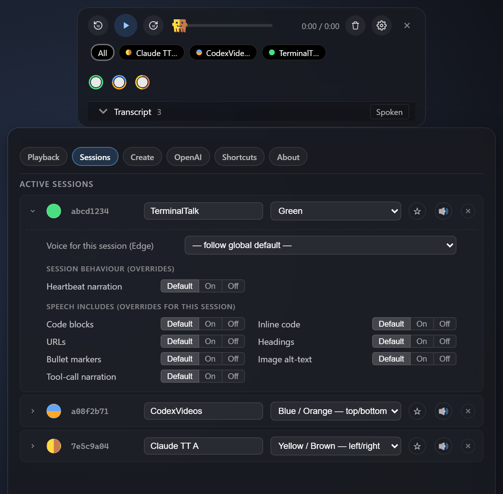 |

| Create a session | OpenAI TTS tab |
|---|---|
| 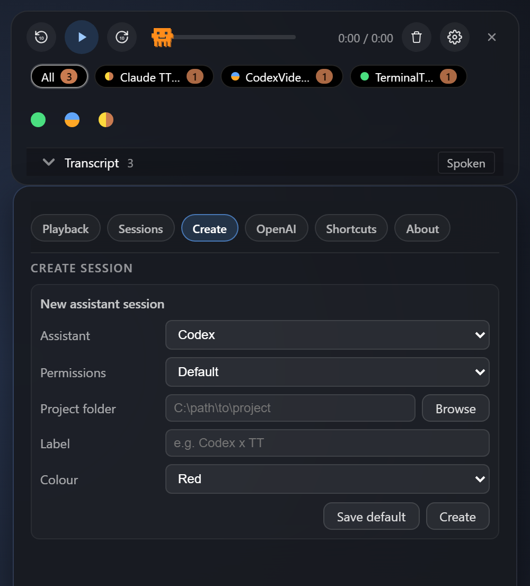 | 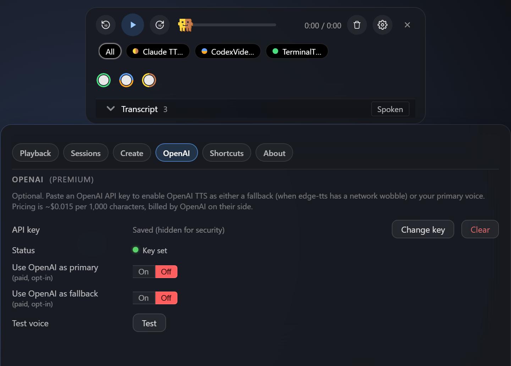 |

---

## Install (Windows)

```powershell
git clone https://github.com/benfrancisburns-creator/terminal-talk
cd terminal-talk
.\install.ps1
```

**Prerequisites:** Windows 10/11, [Git](https://git-scm.com/download/win), [Python 3.10+](https://www.python.org/downloads/windows/), [Node.js 18+](https://nodejs.org/en/download), a working microphone. Allow 3–10 minutes (varies with network and disk speed; first `npm install` is the long step).

The installer pip-installs `edge-tts`, `openwakeword`, `onnxruntime`, `sounddevice`, `numpy`; pre-downloads the `hey_jarvis` wake-word model (~30 MB, one-time); runs `npm install` for Electron; copies everything to `%USERPROFILE%\.terminal-talk\`; then asks whether to register Claude Code hooks, Codex CLI hooks, the per-terminal coloured statusline, a Desktop shortcut, and auto-launch at login. It also adds a Start Menu shortcut for **Terminal Talk**.

Re-running `install.ps1` is safe — it updates in place and preserves your `config.json` and session colour assignments.

### First launch: SmartScreen warning

Terminal Talk is not yet code-signed (an EV / Azure Trusted Signing certificate is on the roadmap once funding is in place — see [SECURITY.md](SECURITY.md#known-limitations)). On first launch Windows SmartScreen will show a blue prompt: *"Windows protected your PC."*

Click **More info** → **Run anyway**. This is a one-time prompt; subsequent launches don't re-trigger it. The same is true for any open-source unsigned Electron app on Windows.

### Installer flags

`install.ps1` accepts the following flags so power users can predict prompts and side-effects before running:

| Flag | Default | Effect when `-Unattended` |
|---|---|---|
| `-Unattended` | (off) | Skip all interactive prompts; use the defaults below. Required for headless/scripted installs. |
| `-HooksYes` | `$true` | Register Claude Code hooks. |
| `-StatuslineYes` | `$true` | Install the per-terminal coloured statusline. |
| `-CodexHooksYes` | `$false` | Register Codex CLI hooks. |
| `-StartupYes` | `$false` | Add the toolbar to Windows startup. |
| `-DesktopShortcutYes` | `$true` | Create a Desktop shortcut. |

Example, fully unattended install with Codex hooks and auto-startup:
```powershell
.\install.ps1 -Unattended -CodexHooksYes:$true -StartupYes:$true
```
Without `-Unattended`, the installer prompts interactively for each of the optional steps regardless of the other flag values.

---

## What's offline and what isn't

- ✅ **Wake-word detection** — openWakeWord runs on CPU, no network. Audio never leaves your machine for wake detection.
- ❌ **TTS synthesis** — Microsoft Edge TTS is a cloud service. The text being spoken goes to `speech.platform.bing.com`. Same endpoint Edge browser uses for "Read Aloud." Full detail in [Privacy & Security](#privacy--security).
- ✅ **Everything else** — session tracking, the toolbar UI, audio playback, file management, colour registry, statusline — all run locally.

---

## Integration details

- **Claude Code integration.** First-class support via three hooks (`UserPromptSubmit`, `PreToolUse`, `Stop`) registered into `~/.claude/settings.json` at install time, plus a transcript-watcher that streams synth as Claude generates — audio begins ~2–3 seconds in, not 6–24 seconds after the turn ends. Each terminal gets a unique colour/split-palette identity + matching statusline glyph so you can identify sessions by ear and by sight. Per-session muting / focus / voice / heartbeat / speech-includes overrides all wire through the same registry.
- **Codex CLI integration.** First-class support via native Codex hooks for session identity and working state, plus rollout tailing for assistant `commentary`, `final`, shell-command narration, and patch narration. Codex sessions appear in Settings with their own colour entry; per-session voice / heartbeat / mute / speech-includes overrides apply identically. Terminal Talk's Codex launcher binds the provisional Windows Terminal tab to the real Codex rollout session as soon as the real session id arrives, so created sessions keep the selected label and colour instead of leaving duplicate stale rows.
- **Claude Desktop Code and Codex Desktop identity sync.** Desktop sessions are persistent, so Terminal Talk treats them as local assistant sessions rather than disposable terminal PIDs. The Settings table marks desktop-origin rows and exposes a sync action that writes the current Terminal Talk label/colour into the desktop app's local title surface where the app allows it. Codex Desktop and Claude Desktop can cache sidebar labels until the renderer refreshes; Terminal Talk keeps the local registry and persisted desktop metadata aligned so a reselect/restart still resolves to the same identity. The MCP server (`app/terminal-talk-mcp-server.js`) exposes five tools — `register_session`, `speak`, `mark_working`, `set_session`, `list_sessions` — for desktop apps and custom integrations to register themselves and route audio through the queue. Full schema, parameters, and examples in [docs/MCP-API.md](docs/MCP-API.md).
- **"Hey jarvis" → read highlighted text.** Works in any app — browser, PDF, VS Code, Slack. Select text, say the wake word (or press `Ctrl+Shift+S`), hear it read. `Ctrl+Shift+J` toggles the mic listener cleanly on and off.
- **Claude Code permission-prompt alerts.** When Claude Code asks to use a tool, a short voice notification fires so you don't have to watch the screen waiting for a prompt.
- **Smart tool-call narration.** Claude gets the richest version through `PreToolUse`: "Looking at the renderer file" instead of "Reading renderer.js", edit summaries with enclosing-function detection, Glob / Grep result counts, and shell commands mapped to intent. Codex gets the same T-prefixed progress-clip path from rollout events where available, including natural shell-command phrases and patch summaries.
- **Markdown-aware audio sanitiser.** GFM tables don't disappear — they get summarised as "Table with 3 rows. Columns: A, B, C." Code fences are stripped or kept based on the language tag and your `code_blocks` setting. Inline backticks, emphasis, bullets, headings, image-alt — each independently toggle-able per session.
- **Transcript expandable panel.** Toolbar surface showing the recent clip queue with copy buttons and a Spoken / Original toggle (compare what was synthesised against the original Markdown). Filters to the currently selected session tab.
- **Per-session controls.** Mute individual terminals (no synthesis, no clips), focus one to prioritise its clips in the queue, give each a custom voice, and override heartbeat / speech-include behaviour per session (code blocks, URLs, headings, etc.).
- **Auto-pauses when you dictate.** If another app (Wispr Flow, Windows Voice Access, VoIP) grabs the mic, Terminal Talk pauses whatever's playing so it doesn't talk over you. Releases and resumes automatically. New arrivals that land during the dictation window queue up and drain in order once the mic's free — they never burst all at once.
- **Claude Code end-of-reply closer.** At the end of each Claude response, Terminal Talk speaks the exact verb from the terminal footer — "Brewed for 8m 49s", "Sautéed for 1m 0s", "Cogitated for 24m 56s". Read directly off the Windows Terminal buffer via UI Automation so the audio matches what you see.
- **Runs in the background.** Small always-on-top toolbar snaps to the top or bottom edge, auto-collapses after the configured idle delay (3 s by default), and becomes click-through when hidden. The collapsed state is now a short 1-inch waveform letterbox: when audio plays, the line animation grows while the border pulse tightens, and both honour solid, horizontal-split, and vertical-split palette assignments. `Ctrl+Shift+A` is the universal show/hide recovery hotkey.

### Assistant support matrix

| Capability | Claude Code CLI | OpenAI Codex CLI | Claude Desktop Code | Codex Desktop |
|---|---|---|---|---|
| Assistant replies spoken aloud | Hooks + transcript-watcher streaming | Native hooks for identity/work state; rollout watcher for spoken replies | Via Claude Code session files/hooks where available | Via Codex app-server / rollout state where available |
| Shared queue, transcript, session colours, voices, heartbeat, mute/focus | Yes | Yes | Yes, through the shared registry | Yes, through the shared registry |
| Visible identity surface | Claude statusline glyph + label | Windows Terminal tab title + Terminal Talk registry | Desktop Code recent/sidebar title sync where the renderer refreshes | Codex Desktop chat title/sidebar sync where the renderer refreshes |
| "Hey jarvis" from the active session inherits session colour | Yes, via statusline/PID file | Yes, via live Codex PID sync | Best effort from foreground/registry match | Best effort from foreground/registry match |
| Tool-call narration | Smart Claude hook path | Rollout-derived shell / patch progress clips | Same Claude Code hook path when Desktop Code is running hooks | App-server/rollout-derived messages where exposed |
| Heartbeat ambient narration | Working flag from UserPromptSubmit/Stop hooks | Working flag from native UserPromptSubmit / tool / Stop hooks | Registry-backed when hook/session files expose state | Registry-backed when app-server/rollout state exposes state |
| Permission alerts, footer closer | Yes, Claude hook + terminal-buffer path | Not exposed by Codex session logs | Claude Code footer path where the Desktop Code terminal surface exposes it | Not exposed by Codex Desktop |

## Full UI reference

Current screenshots are rendered from the same Electron DOM/CSS that ships in the app via the UI kit mirror, so they track the real toolbar rather than hand-built mockups.

### 01 · Resting with active conversations

<p align="center">
  
</p>

The baseline expanded toolbar. It is frameless, always-on-top, draggable, and uses the top tab strip only for active sessions or sessions that still have clips in the queue. Registry-only sessions stay out of this top strip and live in Settings › Sessions, so the day-to-day playback surface does not get cluttered.

### 02 · Queue with three sessions

<p align="center">
  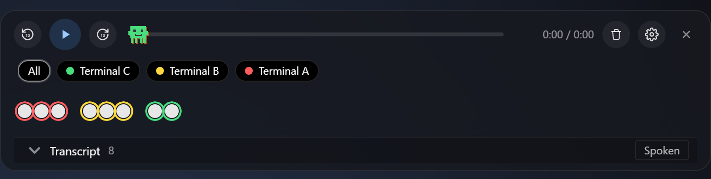
</p>

Three terminals queued in arrival order: **3 red** from Terminal A (first one playing, 2 queued behind), **3 yellow** from Terminal B, **2 green** from Terminal C. The 12 px gap between runs marks a change of speaker so the timeline reads as **A A A — B B B — C C** at a glance. Oldest left, newest right, never re-sorted. If Terminal C has the important message you'd wait through 5 clips first — that's what the Sessions focus star solves.

### 03 · Mixed states in one queue

<p align="center">
  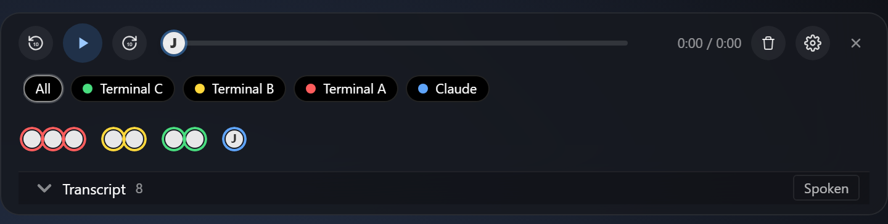
</p>

A real queue in flight. Reading left to right: Terminal A (red) sent 3 clips — you've **heard** the first two (faded, click to replay, right-click to delete) and the third is **playing** now (pulsing white ring around the same red). Terminal B (yellow) has 2 **queued** flat discs behind it, then Terminal C (green) has 2 more. The blue dot on the far right is a **J-clip** — a highlight-to-speak capture from "hey jarvis" / `Ctrl+Shift+S`; J-clips have the highest priority and jump the whole queue when they arrive. Auto-prune removes heard clips after 3–600 s (default 20 s); muted sessions never produce dots at all.

### 04 · Collapsed waveform signal

<p align="center">
  
  
  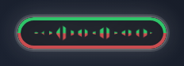
</p>

The collapsed state is a compact click-through letterbox, roughly an inch wide. At rest it stays quiet and unobtrusive. When audio plays, the waveform and border pulse in the currently speaking session's palette. Split colours are preserved: left/right palettes render as horizontal border splits, and top/bottom palettes render as vertical border splits, so rare two-colour identities remain distinguishable at a glance.

### 05 · Transcript panel expanded

<p align="center">
  
</p>

The transcript panel opens below the dot strip. It keeps recent spoken clips visible, lets you copy a row without searching the terminal, and follows the same session tab filter as the dot strip.

### 06 · Tabbed Settings panel

<p align="center">
  
</p>

The gear opens a tabbed settings panel instead of one long scrollbar. **Playback** handles speed, master volume, auto-collapse, body-clip auto-prune, auto-continue, colour-blind palette, heartbeat narration, and reload. **Sessions** lists active assistant sessions with chevron, palette swatch, short id, editable label, palette selector, focus star, mute, and remove. **Create** opens Codex, Claude Code, or Claude Desktop Code sessions with project folder, label, colour, and permissions choices. **OpenAI** is a full page for premium TTS routing, saved-key status, and Test. **Shortcuts** owns the global hotkeys. **About** is the in-app reference guide.

**Playback precedence** — (1) "hey jarvis" / `Ctrl+Shift+S` highlight-to-speak always wins · (2) unplayed clips from the focused ★ session jump the queue · (3) oldest unplayed clip from any unmuted session. That's how you make Terminal C's important reply play before Terminal A's 3-deep ramble.

### 07 · Sessions and per-session overrides

<p align="center">
  
</p>

Each row is backed by `~/.terminal-talk/session-colours.json`. The 24-arrangement palette includes 8 solid colours, 8 top/bottom splits, and 8 left/right splits. The dropdown labels show when a colour is already used, and the expanded row gives that session its own voice, heartbeat override, and tri-state speech-includes.

### 08 · Create a session

<p align="center">
  
</p>

The Create tab starts a new assistant session from Terminal Talk. It can launch Codex, Claude Code, or Claude Desktop Code, seed the label/colour before the assistant speaks, and mark used colours in the picker so you do not accidentally collide with an active session. For Codex CLI, the launcher keeps the provisional terminal tab and the real rollout session bound together once Codex emits its true session id.

### 09 · Snapped to the top edge

<p align="center">
  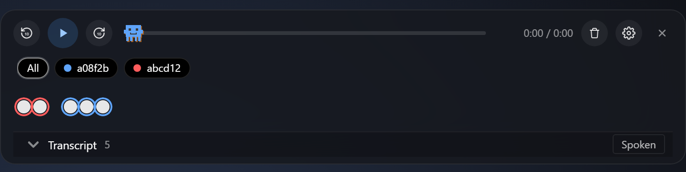
</p>

Drag within ~20 px of the top or bottom edge and the bar snaps flush on release. The bar is **horizontal-only** — left/right edges aren't snap targets. `Ctrl+Shift+A` toggles the whole toolbar on and off; if it ever ends up somewhere weird, that hotkey is the recovery path and the bar re-centres on primary if it's dragged off every display.

## Who it's for

- **Claude Code and Codex CLI users** working in the terminal who want assistant replies read aloud.
- **Claude Desktop Code and Codex Desktop users** who want persistent desktop chats to keep the same Terminal Talk identity, colour, voice, and transcript history as their terminal workflow.
- **Anyone** who wants a fast "select text, hear it" keystroke — no agent required.
- **Voice-first workflows** — combine with a speech-to-text tool and you barely touch the keyboard. See [Companion dictation tools](#companion-dictation-tools-optional) near the bottom.

---

## Usage

### Hotkeys

All hotkeys are **global** — they work from any app. Nothing is captured from the toolbar's own window, so typing `Space` or arrow keys anywhere else can never trip playback.

| Shortcut | Action |
|---|---|
| `Ctrl+Shift+A` | Show / hide the toolbar (your recovery hotkey) |
| `Ctrl+Shift+S` | Read the currently highlighted text |
| `Ctrl+Shift+J` | Toggle wake-word listening (chime confirms on/off) |
| `Ctrl+Shift+P` | Pause / resume playback |
| `Ctrl+Shift+O` | Pause-only (doesn't auto-resume on next clip) |
| `Ctrl+R` | Reload toolbar (same as Settings › Reload button) — use if the UI ever looks stuck |
| Say "hey jarvis" | Reads highlighted text when followed by silence, or accepts short commands like play / pause / next / back / stop |

### Wake word

Highlight text, say **"hey jarvis"**, pause, and Terminal Talk reads the selection. The 30 MB model lives in `~/.terminal-talk/...` and runs entirely on CPU — no audio leaves your machine for wake-word detection.

After the wake word, Terminal Talk briefly listens for a small local command vocabulary (`play`, `pause`, `resume`, `next`, `back`, `stop`, `cancel`). A recognised command controls the toolbar playback; silence falls through to the highlighted-text path. The manual `Ctrl+Shift+S` hotkey skips wake-word recognition and reads the current selection directly.

Want a different wake word? Edit `WAKE_WORDS` in `~/.terminal-talk/app/wake-word-listener.py`. openWakeWord ships `hey_mycroft`, `hey_rhasspy`, `alexa`, `timer`, `weather`.

### Codex CLI

Codex auto-speak is built in. Open a normal terminal in any project folder and run `codex`; the project does not need any Terminal Talk files inside it. Terminal Talk tails `~/.codex/sessions/` for assistant `commentary` and `final` messages. With Codex hooks enabled, each hook event sends the real `session_id` on stdin, so Terminal Talk can bind the terminal to the same colour/name registry without guessing. The terminal title stays quiet: colour marker + the Settings session label, with no short-id clutter.

When Claude Code launches Codex as its plugin/app-server helper, Terminal Talk keeps that session audible but labels it separately as `Claude Codex - <project folder>`. Those sessions are marked internally as `codex-plugin`, so they do not look like mystery terminals in the Settings panel. Random non-terminal Codex rollout files are still ignored unless a live hook has identified the session, which keeps background files from flashing the letterbox or stealing palette slots.

Claude Code has a command-backed `statusLine`, so Terminal Talk can draw the glyph inside Claude's footer. Codex CLI exposes lifecycle hooks rather than a footer command, so Terminal Talk uses those hooks for registry identity, terminal title updates, and heartbeat state; rollout watching remains as a slower fallback for terminals that have not fired a hook yet.

### Close, quit, and reopen

- The toolbar **X** hides the window; audio, wake-word listening, and background watchers keep running. Press `Ctrl+Shift+A`, use the tray icon, or open **Start Menu › Terminal Talk** to show it again.
- To fully exit, right-click the tray icon and choose **Quit**, or stop `terminal-talk.exe` in Task Manager.
- After a full quit or Task Manager kill, reopen from the **Terminal Talk** Desktop or Start Menu shortcut. No terminal command is required.
- The optional Startup shortcut only controls launch-on-login.

### The toolbar UI

```
╭──────────────────────────────────────────────────────────────────╮
│  ◀◀10  [▶]  10▶▶   ●━━━━━━━○━━━━━━━━━  1:23 / 2:10  🗑  ⚙  ✕   │  ← controls
│  ● ● ● | ● ● | ● ● ● ● ● ●                                       │  ← dot strip
╰──────────────────────────────────────────────────────────────────╯
                           ↑        ↑
                 run gap  —  different terminal
 • Oldest (plays first) on the left; newest on the right
 • Gaps between runs show which terminal spoke when
 • Idle delay (3 s default) → shrinks to a thin strip; hover to expand
```

- Each dot = one audio clip in the queue.
- **Dot colour = session colour** (matches the Claude footer/statusline, Codex terminal title/launcher binding, and desktop title-sync metadata where available). Muted sessions don't show dots at all.
- **Clips autoplay the moment they land.** Auto-prune clears played clips after 20 s by default (configurable 3-600 s, or toggle off if you're stepping away).
- **Currently playing** dot glows with a white pulsing halo (same size as the others — no layout jump).
- **Session tabs row** (above the dots) — shows active sessions and any session with unplayed/unpruned clips. Registry-only inactive sessions stay in Settings › Sessions. Click a tab to filter the dot strip and transcript; click "All" to re-show everything. If there are too many live/clip-backed sessions to fit, left/right arrows page through the row without making the toolbar huge.
- **Click** a dot to (re)play it manually. **Right-click** to delete immediately.
- Clips for "hey jarvis" / `Ctrl+Shift+S` carry a small **J** label so you can tell them from auto-spoken assistant responses.
- Up to ~40 dots visible; beyond that the oldest drop off.
- **Drag the toolbar** near the top or bottom edge of any display and it snaps flush. Horizontal-only — no vertical dock. Position is saved across launches. If it ever ends up somewhere weird, `Ctrl+Shift+A` toggles it and the bar re-centres if it's off every display.
- **Collapsed mode** is a short waveform letterbox. It flashes and animates only for the session whose clip is actually playing, so queued or muted arrivals do not steal the colour while another session is speaking.
- **🗑 Clear played** — one-click removal of every heard clip (currently-playing clip is kept). A toast appears with a 10-second **Undo** window before the files are actually deleted from disk, so a misclick is never destructive. The `X` on the toast dismisses without restoring.

### Settings panel (gear icon)

The gear expands the toolbar into a tabbed settings bar. The tabs are deliberately separated so playback, registry management, session creation, provider setup, shortcuts, and product guidance are not buried in one long scroll.

| Tab | Scope | Technical effect |
|---|---|---|
| **Playback** | Speed, master volume, auto-collapse, body-clip auto-prune, click-to-continue, colour-blind palette, heartbeat narration, reload | Writes `playback.*`, `heartbeat_enabled`, and palette variant values in `~/.terminal-talk/config.json`; reload rebuilds the renderer without restarting Electron. |
| **Sessions** | Active/registered assistant sessions, label, palette, focus, mute, remove, desktop sync, expanded voice and speech rules | Writes `~/.terminal-talk/session-colours.json`. The same entry drives toolbar tabs/dots, Claude statusline identity, Codex title binding, desktop title-sync metadata, voice selection, mute/focus, heartbeat override, and speech-includes override. |
| **Create** | Launch Codex, Claude Code, or Claude Desktop Code with project folder, label, colour, assistant type, and permissions mode | Seeds the selected identity before launch, then binds provisional terminal/window state to the real assistant session id when hooks or rollout metadata arrive. |
| **OpenAI** | Saved-key status, Change/Clear key, primary provider, fallback provider, voice test | Stores keys through Electron `safeStorage` plus a user-ACL'd hook sidecar; OpenAI is never used unless explicitly selected as primary or fallback. |
| **Shortcuts** | Global hotkeys and wake-word controls | Shows the active accelerators backed by `config.json`; these work outside the toolbar window. |
| **About** | Intended use, feature breakdown, privacy notes, integration notes, identity model, and troubleshooting pointers | In-app technical reference for users who need to understand what the toolbar is doing without opening the README. |

Key behaviour:

- **Auto-prune** applies to body clips only. Tool narration (`T-` files) and heartbeat verbs (`H-` files) always auto-delete after play-end so tool chains do not flood the queue.
- **Master volume** is live while audio plays. Heartbeat clips stay at 0.45× the master level so background status remains quieter than response audio.
- **The Sessions colour dropdown** has 24 arrangements: 8 solid colours, 8 top/bottom splits, and 8 left/right splits. Used colours are called out in the picker.
- **Desktop sync badges** appear on supported Claude Desktop Code and Codex Desktop rows. Some desktop renderers cache sidebar titles; Terminal Talk still persists the registry and local title metadata so reselect/restart resolves to the same identity.

#### Transcript panel

A second collapsible surface in the toolbar, separate from Settings. Lists the most recent clips (Claude + Codex + highlight-to-speak) with:

- **Copy buttons** for each clip — grab the spoken text fast.
- **Spoken / Original toggle** — flip between the sanitised text edge-tts actually saw and the raw Markdown the assistant produced. Useful for confirming the sanitiser kept what mattered (or didn't).
- **Per-session filtering** — the currently selected session tab scopes the list, so the transcript view stays in lockstep with the dot strip above.

Clips that pre-date the panel show their spoken side only; the Original column populates for any new clip from this version onward.

### Per-session overrides

Click the chevron on any session row to expand its per-session controls:

- **Voice for this session** — pick any of the 45 verified Edge TTS English voices. Two terminals open? Give them different voices and you'll _hear_ which one spoke without even looking. Leave on _"follow global default"_ to use the main voice.
- **Heartbeat narration override** — Default follows the global Settings toggle; On forces heartbeat clips for this session; Off disables them for this session.
- **Speech includes overrides** — seven tri-state toggles per session:

  | Toggle | What it controls |
  |---|---|
  | Code blocks | ` ```code``` ` blocks (content kept, fences and language tag stripped) |
  | Inline code | `` `code` `` spans (content kept, backticks stripped) |
  | URLs | bare `https://…` links |
  | Headings | `# Heading` lines |
  | Bullet markers | `- item` / `1. item` prefixes |
  | Image alt-text | `` alt attribute |
  | Tool-call narration | Ephemeral spoken "Reading foo.py" / "Running npm test" clips during tool chains |

  Each toggle is **Default** (follow global), **On** (always speak), or **Off** (always skip). Saved to the session entry in `~/.terminal-talk/session-colours.json` and applied on the next turn — no restart needed.

### How session colours work

When a terminal session first interacts with Terminal Talk, it gets the **lowest free colour index** in `~/.terminal-talk/session-colours.json`. The same registry entry informs both:

- The glyph at the bottom of the Claude terminal, or the Codex terminal title/PID mapping.
- The dot colour on the toolbar.
- The colour of the **J** label on highlight-to-speak clips originating from that terminal.

Sessions only release their colour when the assistant process actually closes (and a 4-hour grace period elapses to absorb stale-PID windows). You can also pin a colour manually via the Sessions table dropdown — pinned colours never get reassigned.

When a "hey jarvis" / `Ctrl+Shift+S` fires from somewhere outside a tracked assistant terminal (browser, PDF), the J dot renders **neutral grey**. From inside a tracked Claude Code or Codex terminal, it inherits that terminal's colour.

---

## Three tiers

### 🆓 Free (default)

- **Wake word**: [openWakeWord](https://github.com/dscripka/openWakeWord) — MIT, offline, runs on CPU.
- **TTS**: [edge-tts](https://github.com/rany2/edge-tts) — Microsoft Edge's neural voices (45 verified English voices across UK, US, AU, IE, CA, IN, NZ, ZA, HK, SG, PH, NG, KE, TZ).
- No accounts. No API keys.

### 💳 Premium TTS (optional)

Add an [OpenAI API key](https://platform.openai.com/api-keys) for OpenAI TTS (`alloy`, `echo`, `fable`, `onyx`, `nova`, `shimmer`). OpenAI is never used as a hidden fallback just because a key exists: Edge remains the free default. You can explicitly turn OpenAI on as the primary provider, or opt into OpenAI fallback if you want paid rescue when Edge has a network wobble. Monitor credits or enable OpenAI billing auto top-up/auto recharge if you choose that. Billed directly by OpenAI.

**Easiest path — Settings panel:**
1. Click the gear, open the **OpenAI** tab.
2. Paste your key into the password field, click **Save**. The input disappears once saved (a "Change key" link brings it back if you ever need to rotate).
3. Click **Test** to confirm it works — you'll hear a short phrase in the OpenAI voice.
4. Flip **Use OpenAI as primary** on to make OpenAI the default.
5. Leave **Use OpenAI as fallback** off for the free Edge fallback. Turn it on only if you intentionally want OpenAI to spend credits when the primary provider fails.

The key is stored encrypted via [Electron safeStorage](https://www.electronjs.org/docs/latest/api/safe-storage) (DPAPI on Windows, Keychain on Mac) at `~/.terminal-talk/openai_key.enc`. A user-ACL'd plaintext sidecar at `~/.terminal-talk/config.secrets.json` is written for the PowerShell hooks that can't reach safeStorage. Neither file is in `config.json` or git.

**Headless / advanced alternatives:**
- Environment variable `OPENAI_API_KEY=sk-...` (process-lifetime only)
- `~/.claude/.env` — existing Claude Code setup is auto-detected

### 🎙️ Voice-in + voice-out (bonus)

Install a speech-to-text tool from the [Companion dictation tools](#companion-dictation-tools-optional) table near the bottom. Say _"Claude, refactor this function"_ or _"Codex, write the test"_ → your assistant processes → Terminal Talk reads the answer back. Fully hands-free. When you activate your dictation tool mid-playback, Terminal Talk auto-pauses so you're not talking over yourself.

---

## Configuration

`~/.terminal-talk/config.json` (created on first install, preserved on re-install). Most playback, provider, and session fields below have UI controls in the Settings panel. Hotkey accelerators are config-backed and shown in the Shortcuts tab; edit the file directly for now if you need to remap them.

```json
{
  "voices": {
    "edge_clip":       "en-GB-SoniaNeural",
    "edge_response":   "en-GB-RyanNeural",
    "openai_clip":     "shimmer",
    "openai_response": "onyx"
  },
  "hotkeys": {
    "toggle_window":    "Control+Shift+A",
    "speak_clipboard":  "Control+Shift+S",
    "toggle_listening": "Control+Shift+J",
    "pause_resume":     "Control+Shift+P",
    "pause_only":       "Control+Shift+O"
  },
  "playback": {
    "speed":                     1.25,
    "master_volume":             1.0,
    "collapse_delay_sec":         3,
    "auto_prune":                true,
    "auto_prune_sec":            20,
    "auto_continue_after_click": true,
    "palette_variant":           "default",
    "tts_provider":              "edge",
    "tts_fallback_provider":     "edge"
  },
  "speech_includes": {
    "code_blocks":    false,
    "inline_code":    false,
    "urls":           false,
    "headings":       true,
    "bullet_markers": false,
    "image_alt":      false,
    "tool_calls":     true
  },
  "heartbeat_enabled": true,
  "openai_api_key": null
}
```

Key fields worth calling out:

- **`playback.master_volume`** (0.0–1.0, default 1.0) — master output volume. Heartbeat clips stay at 0.45× this value so the ambient mix ratio is preserved at any master level.
- **`playback.collapse_delay_sec`** (1–120, default 3) — how long the toolbar stays expanded after the last interaction before auto-collapsing to the slim click-through strip. Playback does not pin the full toolbar open; the collapsed strip stays coloured by the speaking session.
- **`playback.palette_variant`** (`"default"` | `"cb"`, default `"default"`) — swaps the 8-colour session palette for Paul Tol's "muted" scheme under deutan / protan / tritan colour-blindness.
- **`playback.tts_provider`** (`"edge"` | `"openai"`, default `"edge"`) — which TTS provider to try first. Setting this to `"openai"` needs a saved OpenAI key.
- **`playback.tts_fallback_provider`** (`"edge"` | `"openai"` | `"none"`, default `"edge"`) — which provider to try if the primary fails. The default keeps fallback free; set to `"openai"` only when you intentionally want paid fallback and are tracking OpenAI credits.
- **`speech_includes.tool_calls`** (default `true`) — narrate assistant tool progress as ephemeral clips (e.g. _"Looking at the renderer file"_, _"Running the tests"_, _"Searching the codebase"_). Claude uses the `PreToolUse` hook; Codex uses rollout tool events when available. Clips auto-delete on play-end so long tool chains don't flood the dot strip.
- **`heartbeat_enabled`** (default `true`) — during the silent gap while Claude Code or Codex is working, play short spinner-verb + thinking-phrase clips every ~8 s so you know the assistant is alive, not stuck. Mirrors the visible mascot word-cloud. Stops the moment real response audio begins. Individual sessions can override this with `heartbeat_enabled` in `session-colours.json`.
- **`openai_api_key`** — always stays `null` in `config.json`. Real keys go through the Settings panel and land in the safeStorage-encrypted sidecar. Setting the key here directly still works but leaves it in plaintext on disk, so don't unless you know you need to.

Per-session overrides live in `~/.terminal-talk/session-colours.json` (managed by the toolbar UI, but you can edit by hand). Each session entry can have an optional `voice`, optional `heartbeat_enabled`, and an optional `speech_includes` partial:

```json
{
  "assignments": {
    "abcd1234": {
      "index": 3,
      "label": "Frontend",
      "pinned": true,
      "voice": "en-US-AriaNeural",
      "heartbeat_enabled": false,
      "speech_includes": { "code_blocks": true, "urls": false }
    }
  }
}
```

Restart the toolbar after editing config.json by hand:
```powershell
taskkill /F /IM terminal-talk.exe
wscript "$env:USERPROFILE\.terminal-talk\terminal-talk.vbs"
```

---

## Privacy & Security

What Terminal Talk does:

| Action | Where it goes | Why |
|---|---|---|
| Wake-word detection | **Local only** (CPU, no network) | openWakeWord runs entirely offline. Audio is processed in-process and discarded. |
| TTS synthesis (free) | `speech.platform.bing.com` (Microsoft Edge TTS service) | The text being spoken is sent to Microsoft. Same endpoint Edge uses for "Read aloud." |
| TTS synthesis (premium) | `api.openai.com/v1/audio/speech` | Only if you've configured an OpenAI key. The text being spoken is sent to OpenAI. Keys are stored encrypted via [Electron safeStorage](https://www.electronjs.org/docs/latest/api/safe-storage) (DPAPI on Windows, Keychain on Mac) at `~/.terminal-talk/openai_key.enc`; a user-ACL'd plaintext sidecar at `config.secrets.json` is written for the PS hooks that can't reach safeStorage. Neither is in `config.json` or git. |
| Audio file storage | `~/.terminal-talk/queue/` | Local mp3/wav files. Auto-deleted 90s after manual play, or capped at 20 clips. |
| Session registry | `~/.terminal-talk/session-colours.json` + `~/.terminal-talk/sessions/<pid>.json` | Local-only. Tracks colour assignments and a short-lived per-PID file used to map foreground window → session. |
| Logs | `~/.terminal-talk/queue/_*.log` | Local-only diagnostic logs (toolbar, hook, voice listener). |
| Clipboard | Read locally during "hey jarvis" capture | Never sent anywhere except as TTS input above. |

What Terminal Talk does **not** do:
- No telemetry, analytics, error reporting, or "phone home" — anywhere in the codebase.
- No cloud account required (the free tier).
- No background recording or transcription. The wake-word listener processes 80 ms audio chunks locally and discards them.
- No modification of files outside `~/.terminal-talk/` and (if you opt in to hooks) `~/.claude/settings.json` (with backup).

**Permissions Terminal Talk needs:**
- Microphone access (for wake word).
- Network access to `speech.platform.bing.com` (TTS) and optionally `api.openai.com`.
- Read/write to `~/.terminal-talk/`.
- Write to `~/.claude/settings.json` (only at install/uninstall, with timestamped backup).
- Send Ctrl+C and Ctrl+Shift+S keystrokes to the foreground window (used to capture highlighted text after wake word).

---

## Self-cleanup watchdog

Terminal Talk polices itself so loose ends don't accumulate while it's running:

- **Single-instance lock** — at launch, if another Terminal Talk is already running (e.g. auto-start fired while you double-clicked the shortcut), the new process surfaces the existing window and exits immediately. You never end up with multiple main instances in Task Manager.
- **Startup sweep** — on every launch: prune audio files > 1 h old, delete `.partial` files > 60 s old (crash leftovers), drop session PID files whose PIDs are dead, and kill any orphan `wake-word-listener.py` Python process from a previous session that lost its parent.
- **Periodic sweep (every 30 min)** — the same three cleanup passes run automatically while the app is up. Each sweep appends one line to `~/.terminal-talk/queue/_watchdog.log` (`timestamp · pruned N audio, N session files · Xms`) so you can see it doing its job.
- **Mic teardown** — when wake-word listening is toggled off, the Python listener closes its `InputStream` (actually releasing the microphone at the driver level, not just muting input). The Electron side also orphan-sweeps before every listener spawn as belt-and-braces against a hot mic from a crashed previous session.

If anything ever feels "stuck", the watchdog log is the first place to look — `tail ~/.terminal-talk/queue/_watchdog.log`.

---

## Tests

A large unit/integration harness plus 39 Playwright E2E tests exercise the actual installed components:

```powershell
node terminal-talk/scripts/run-tests.cjs --verbose
```

Coverage highlights:

- **Codex integration** — native hook session binding, quiet colour/name title sync, rollout-file delta tracking, `agent_message` event extraction (commentary + final phases), provisional-to-real session rebinding for toolbar-created terminals, per-session promise tail chain ordering, signature dedup against rewrite-replay, registry-touch persistence.
- **Desktop identity sync** — Codex Desktop and Claude Desktop title metadata writers, UIA live-rename helper coverage, registry preservation, and sync status plumbing.
- **Tool narration** — flag-aware path capture (`ls -lat /path` doesn't capture `-lat`), echo-header peeling for `;` / `|` separators, batch-level dedup of identical phrases, enclosing-scope detection from structuredPatch + originalFile walk.
- **Sanitiser** — GFM table summarisation in both Python and JS sanitisers, code-fence language detection, inline-code stripping, parity invariant between `synth_turn.py` and `app/lib/text.js`.
- **Click-through state machine** — Ctrl+R reload ordering contract (setIgnoreMouseEvents must run before reload), 5s reload-grace IPC suppression, mic-captured-elsewhere callback ordering (must arm flag before audio guard), audio-player two-flag split (`_micCaptured` + `_systemAutoPaused`).
- **Palette** — 24 arrangements all distinct, edge cases (wrap, negatives, hash-mod), colour-blind variant.
- **Filename parsing** — response, question, notification, clip (session-scoped + neutral, plus `T-` tool-narration and `H-` heartbeat ephemeral prefixes).
- **Statusline assignment** — lowest-free-index, two distinct sessions get different colours, returning sessions keep their slot, label appended to emoji, PID-migration through `/clear`.
- **Edge TTS wrapper** — produces real mp3 from text input; OpenAI premium routing is explicit for primary or paid fallback use.
- **Speech-includes** (`stripForTTS`) — 9 toggle behaviours, content preservation when "On", per-session merge truth table.
- **Voice list validation** — every Edge voice in the dropdown actually exists in Microsoft's catalogue, defaults are valid.
- **Registry handling** — no UTF-8 BOM written, BOM tolerance on read, voice + speech_includes + muted flag + pinned preserved through round-trip writes, lock-fail-skip discipline (#26 / #8 root fix).
- **Sentence splitter** — abbreviation / URL / decimal protection, paragraph-break boundaries, short-merge, hard-split on over-long sentences.
- **synth_turn orchestrator** — transcript extraction, tool_use filtering, sanitisation with code_blocks toggle, questions-first extraction, sync state round-trip, mute skip, J-S1 `flags.get` fallback alignment with DEFAULT_SPEECH_INCLUDES.
- **Pinned sessions** — not pruned even if PID dead and `last_seen` stale.
- **Install sanity** — required files present, config parses, manifest hash check.
- **Self-cleanup watchdog** — single-instance lock, 30-min sweep, orphan listener kill, hard-kill via taskkill /F /T.

Tests are isolated from the live install — they use a tmp registry path so they can't race with your running statusline.

See [CONTRIBUTING.md](CONTRIBUTING.md) for adding new tests.

---

## How it works

Terminal Talk is the hub. Claude Code, Codex CLI, desktop assistant sessions, and highlight-to-speak are separate inputs that feed the same local queue and toolbar:

```
┌──────────────────────────────┐      ┌──────────────────────────────┐      ┌──────────────────────────────┐
│ Claude Code                  │      │ Codex CLI / Desktop app      │      │ "Hey jarvis" / Ctrl+Shift+S  │
│ UserPromptSubmit / PreToolUse│      │ native hooks + rollout logs  │      │ openWakeWord + global hotkey │
│ Stop hooks + transcript watch│      │ title sync + app-server tail │      │ selected text + active app   │
└──────────────┬───────────────┘      └──────────────┬───────────────┘      └──────────────┬───────────────┘
               │                                     │                                     │
               ▼                                     ▼                                     ▼
┌──────────────────────────────┐      ┌──────────────────────────────┐      ┌──────────────────────────────┐
│ synth_turn.py                │      │ codex-session-watcher.js     │      │ speakClipboard()             │
│ streaming body, questions,   │      │ commentary/final messages,   │      │ Ctrl+C capture, stripForTTS, │
│ tool clips, footer closer    │      │ inline Edge/OpenAI synth     │      │ priority J-clips             │
└──────────────┬───────────────┘      └──────────────┬───────────────┘      └──────────────┬───────────────┘
               │                                     │                                     │
               └─────────────────────┬───────────────┴─────────────────────┬───────────────┘
                                     ▼                                     │
                         ~/.terminal-talk/queue/ ◄────────────────────────┘
                         .mp3 / .wav / metadata / logs
                                     │
                                     ▼
┌────────────────────────────────────────────────────────────────────────────────────────────────┐
│ Terminal Talk Electron toolbar                                                                 │
│ dot strip, collapsed waveform, priority J-clips, tabs, transcript, settings, audio-player       │
│ mic auto-pause, master volume, tray, Desktop/Start Menu relaunch                                │
└──────────────────────────────▲─────────────────────────────────────────────────────────────────┘
                               │
             ~/.terminal-talk/voice-command.json
             post-wake play / pause / next / back / stop commands
```

The shared registry lives at `~/.terminal-talk/session-colours.json`. Claude hooks/statusline, Codex native hooks, Codex rollout/app-server watching, desktop title-sync helpers, the Hey Jarvis foreground-window detector, and Electron user edits all read and write that registry under a file lock, so colours, labels, voices, heartbeat overrides, mute/focus state, and speech-includes stay consistent across agent paths. Hey Jarvis clips are priority **J-clips**: they jump the queue, inherit the active tracked terminal colour when one can be detected, and fall back to neutral grey from browsers/PDFs/other apps. Codex gets tool progress narration for shell commands and patches, plus heartbeat working flags from native hook events. Claude-only extensions still include permission prompts and the terminal footer closer because those rely on Claude Code hook and terminal-buffer surfaces that Codex does not expose.

---

## Troubleshooting

| Symptom | Fix |
|---|---|
| Wake word not detected | Check mic in Windows Sound settings. `tail ~/.terminal-talk/queue/_voice.log` for heartbeat scores (~0 = silence, ≥0.5 = fire). |
| Nothing plays after "hey jarvis" | First check the mic listener is on — `Ctrl+Shift+J` toggles it, and a chime confirms (high = on, low = off). If the mic is on and still nothing plays, `tail ~/.terminal-talk/queue/_toolbar.log`. Common causes there: edge-tts network wobble with no fallback enabled, or the clipboard was empty when you said the wake word (highlight text before triggering). |
| Mic locked on, draining battery | `Ctrl+Shift+J` to stop the listener (high chime = on, low chime = off). |
| Hook not firing in Claude Code | Verify `~/.claude/settings.json` `Stop` hook command points to `$env:USERPROFILE\.terminal-talk\hooks\speak-response.ps1`. |
| Desktop app title did not change immediately | Open Settings › Sessions and use the desktop row's sync button. Some Claude Desktop / Codex Desktop renderer paths cache sidebar titles until you reselect the chat or restart the desktop app, but the persisted local metadata and Terminal Talk registry should already agree. |
| Clipboard stays empty after "hey jarvis" | The wake word can be working while the foreground app refuses automated copy. Terminal Talk briefly sends a copy command internally to capture the highlighted text; if that app blocks it, no clip can be made. Reselect the text, make sure the source app still has focus, or test the same flow in Notepad / a browser. |
| Dropdown text invisible (white-on-white) | Indicates Electron's `nativeTheme.themeSource` didn't apply on your build. Reinstall to update. |
| Two terminals on the same colour | Run `node terminal-talk/scripts/run-tests.cjs` — if statusline tests fail, edge-tts service is unreachable. If they pass, restart both terminals. |
| I killed Terminal Talk in Task Manager and need it back | Open **Terminal Talk** from the Desktop or Start Menu. |

---

## Uninstall

```powershell
.\uninstall.ps1
```

Stops running processes (only those in `~/.terminal-talk/`), removes Startup / Start Menu / Desktop shortcuts, strips Terminal Talk hooks from `~/.claude/settings.json` and `~/.codex/hooks.json` (with timestamped backups), optionally deletes `~/.terminal-talk/`.

---

## Companion dictation tools (optional)

Terminal Talk is text-to-speech — assistant output → audio. For the reverse
(your voice → Claude Code or Codex input) and fully hands-free use, pair it with a
dictation tool. A few options, ranked by free-tier generosity:

| Tool | Free tier | Paid | Platform | Notes |
|---|---|---|---|---|
| **[Wispr Flow](https://wisprflow.ai/)** | 2,000 words/wk | $12/mo | Mac, Win, iOS, Android | Best polish. Cloud only. |
| **Windows Speech Recognition** | Unlimited | Free | Windows | Built-in, no signup. Basic quality. |
| **Apple Dictation** | Unlimited | Free | Mac, iOS | Built-in. Decent on M1+. |

For light use (a few prompts/day) any free tier works. For heavy daily use you'll want one of the paid options or the OS built-ins.

Not affiliated with any of these.

---

## About the mascot

The four-legged character on the scrubber is the live session marker. It
uses the same 24-slot palette as the tabs, clip dots, statusline, and
collapsed waveform strip: 8 solid colours, 8 top/bottom splits, and 8
left/right splits. When a session is left/right blue/orange, the mascot is
left/right blue/orange too; it no longer implies the wrong split direction.

The character is also a small homage to
[Claude Code](https://www.claude.com/product/claude-code). When Claude is
thinking, Claude Code shows a spinner line with a tongue-in-cheek verb —
"Moonwalking", "Finagling", "Pontificating", "Flibbertigibbeting" and
[~90 others](https://github.com/levindixon/tengu_spinner_words). Terminal
Talk uses a similar whimsical vocabulary (with credit) and attaches it to
the character while audio plays. The mouth is there because the toolbar is
literally speaking the assistants back to you.

**It appears for assistant response clips from Claude Code and Codex.** If
you're playing a highlight-to-speak clip (you said "hey jarvis" or pressed
<kbd>Ctrl+Shift+S</kbd>), the scrubber thumb is a plain **J** badge instead
so manual read-aloud clips stay visually distinct from agent replies.

No affiliation with Anthropic; this is a solo open-source project by an
enthusiastic Claude Code user. It's here because Claude Code's own sense
of humour is half the reason the tool is a joy to work with, and a bit
of that should live on the toolbar too.

**Trademark note:** "Claude" and "Claude Code" are trademarks of
Anthropic. This project uses neither name as its own and is not
affiliated with Anthropic.

---

## Credits

- [openWakeWord](https://github.com/dscripka/openWakeWord) — offline wake-word detection (MIT)
- [edge-tts](https://github.com/rany2/edge-tts) — Microsoft Edge TTS wrapper (LGPL-3.0)
- [Electron](https://www.electronjs.org/) — the floating toolbar runtime (MIT)
- Wake-word model `hey_jarvis_v0.1` © openWakeWord contributors
- Spinner vocabulary lifted from [levindixon/tengu_spinner_words](https://github.com/levindixon/tengu_spinner_words) — same list Claude Code uses while thinking. No affiliation with Anthropic; see the [About the mascot](#about-the-mascot) section for the why.

## Docs archives

Every minor release freezes the `docs/` tree at the time the first tag on that line was cut, so tag-linked documentation and README images don't rot when the docs on `main` move forward.

- [`docs/v0.2/`](docs/v0.2/) — v0.2 line snapshot (first seeded from `v0.2.0`).

The archival is automatic on tag push via [`.github/workflows/release.yml`](.github/workflows/release.yml); see [`scripts/archive-docs.sh`](scripts/archive-docs.sh) for the portable seed script (works on CI, macOS, Windows Git Bash).

## License

MIT. See [LICENSE](LICENSE).

Contributions welcome — Mac and Linux ports especially. See [CONTRIBUTING.md](CONTRIBUTING.md).
