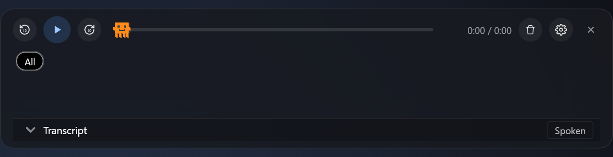

<p align="center">
  
</p>

<p align="center">
  <a href="https://github.com/benfrancisburns-creator/terminal-talk/releases/latest"></a>
  <a href="LICENSE"></a>
  
  
  
  <a href="https://github.com/benfrancisburns-creator/terminal-talk/actions/workflows/test.yml"></a>
</p>

> **Status: v0.6 beta · solo-maintained.** Works well on my machine, covered by a large unit harness plus 28 Playwright E2E tests, but this is still an early widely-shared release — expect rough edges. Issues and PRs welcome. Mac port is next (in planning), Linux after. File bugs via [private Security Advisories](https://github.com/benfrancisburns-creator/terminal-talk/security/advisories/new) (security) or [public Issues](https://github.com/benfrancisburns-creator/terminal-talk/issues) (everything else).

**Claude Code _and_ OpenAI Codex CLI read their replies aloud, and _"hey jarvis"_ reads any highlighted text.**

Two assistants, one toolbar. Terminal Talk auto-speaks Claude Code via hooks _and_ tails local Codex CLI session logs in `~/.codex/sessions/` to speak Codex `commentary` + `final` messages — both go through the same queue, voice pipeline, and per-session colour registry.

Hands-free voice output for terminal coding agents on Windows. Free, MIT licensed, no signup, no accounts. Microsoft Edge TTS (cloud) for voices, openWakeWord (local) for wake-word detection. Colour-blind friendly palette available in Settings › Playback.

**Try it in your browser (no install):** [live interactive toolbar demo](https://benfrancisburns-creator.github.io/terminal-talk/ui-kit/) · [project landing page](https://benfrancisburns-creator.github.io/terminal-talk/)

[Install](#install-windows) · [What it does](#what-it-does) · [What's offline](#whats-offline-and-what-isnt) · [UI states](#ui-states) · [Demo](https://benfrancisburns-creator.github.io/terminal-talk/ui-kit/) · [Privacy](#privacy--security) · [Changelog](CHANGELOG.md) · [Contributing](CONTRIBUTING.md)

### At a glance

|  |  |
|---|---|
| 🟧 **Claude Code integration** — Stop / PreToolUse / UserPromptSubmit hooks + transcript-watcher streams audio mid-turn | 🤖 **Codex CLI integration** — tails Codex rollout sessions, same queue + colours, no hooks needed |
| 🎙️ **"Hey jarvis" → read highlighted text** — works in any app, offline wake-word | 📜 **Transcript panel** — recent clips with copy + Spoken / Original toggle, filtered per session |
| 🎨 **Per-session colours + tabs** — 24-arrangement palette, colour-blind variant built in | 🛠️ **Claude tool narration** — _"Edit to render banner in renderer.js — added 12 lines"_ |
| 🎚️ **Master volume + per-clip mix** — heartbeat stays ambient at any master level | 🔕 **Auto-pauses when you dictate** — Wispr / Voice Access / VoIP never get talked over |
| 🔐 **Encrypted API keys** — OpenAI premium via safeStorage (DPAPI / Keychain) | ⏱️ **Claude end-of-reply verb** — scrapes the terminal footer and speaks _"Brewed for 8m 49s"_ |
| 💬 **Per-session voice + speech-includes** — 45 Edge voices + 6 OpenAI, 7 per-session toggles | 📊 **Markdown-aware sanitiser** — tables, code fences, inline backticks all spoken cleanly |

---

## Install (Windows)

```powershell
git clone https://github.com/benfrancisburns-creator/terminal-talk
cd terminal-talk
.\install.ps1
```

Requires Windows 10/11, Python 3.10+, Node.js 18+, a working microphone. Takes ~3 minutes.

The installer pip-installs `edge-tts`, `openwakeword`, `onnxruntime`, `sounddevice`, `numpy`; pre-downloads the `hey_jarvis` wake-word model (~30 MB, one-time); runs `npm install` for Electron; copies everything to `%USERPROFILE%\.terminal-talk\`; then asks whether to register Claude Code hooks, the per-terminal coloured statusline, Desktop shortcuts, and auto-launch at login. It also adds Start Menu shortcuts for **Terminal Talk** and **Terminal Talk Codex**.

Re-running `install.ps1` is safe — it updates in place and preserves your `config.json` and session colour assignments.

---

## What's offline and what isn't

- ✅ **Wake-word detection** — openWakeWord runs on CPU, no network. Audio never leaves your machine for wake detection.
- ❌ **TTS synthesis** — Microsoft Edge TTS is a cloud service. The text being spoken goes to `speech.platform.bing.com`. Same endpoint Edge browser uses for "Read Aloud." Full detail in [Privacy & Security](#privacy--security).
- ✅ **Everything else** — session tracking, the toolbar UI, audio playback, file management, colour registry, statusline — all run locally.

---

## What it does

- **Claude Code integration.** First-class support via three hooks (`UserPromptSubmit`, `PreToolUse`, `Stop`) registered into `~/.claude/settings.json` at install time, plus a transcript-watcher that streams synth as Claude generates — audio begins ~2–3 seconds in, not 6–24 seconds after the turn ends. Each terminal gets a unique colour dot + matching statusline glyph so you can identify sessions by ear (and optionally give each its own voice). Per-session muting / focus / voice / speech-includes overrides all wired through.
- **Codex CLI integration.** First-class support via a 1-second poll on `~/.codex/sessions/` — no hook registration needed. Terminal Talk tails Codex's persisted rollout JSONL and narrates assistant `commentary` + `final` messages through the same toolbar queue. Codex sessions appear in the Settings panel with their own colour entry; per-session voice / mute / speech-includes overrides apply identically. Run Codex normally, or use **Terminal Talk Codex** from the Desktop / Start Menu to launch Codex with the same TT slot, label, short id and Windows Terminal tab colour.
- **"Hey jarvis" → read highlighted text.** Works in any app — browser, PDF, VS Code, Slack. Select text, say the wake word (or press `Ctrl+Shift+S`), hear it read. `Ctrl+Shift+J` toggles the mic listener cleanly on and off.
- **Claude Code permission-prompt alerts.** When Claude Code asks to use a tool, a short voice notification fires so you don't have to watch the screen waiting for a prompt.
- **Claude Code smart tool-call narration.** When Claude reads a file, the toolbar says "Looking at the renderer file" — not just "Reading renderer.js". Edits surface as "Edit to render continuation banner — added 12 lines" with enclosing-function detection. Glob / Grep narrations include result counts. Bash commands peel echo headers and capture file paths instead of flag values.
- **Markdown-aware audio sanitiser.** GFM tables don't disappear — they get summarised as "Table with 3 rows. Columns: A, B, C." Code fences are stripped or kept based on the language tag and your `code_blocks` setting. Inline backticks, emphasis, bullets, headings, image-alt — each independently toggle-able per session.
- **Transcript expandable panel.** Toolbar surface showing the recent clip queue with copy buttons and a Spoken / Original toggle (compare what was synthesised against the original Markdown). Filters to the currently selected session tab.
- **Per-session controls.** Mute individual terminals (no synthesis, no clips — truly "cut the wire"), focus one to prioritise its clips in the queue, give each a custom voice, override speech-include behaviour per session (code blocks, URLs, headings, etc.).
- **Auto-pauses when you dictate.** If another app (Wispr Flow, Windows Voice Access, VoIP) grabs the mic, Terminal Talk pauses whatever's playing so it doesn't talk over you. Releases and resumes automatically. New arrivals that land during the dictation window queue up and drain in order once the mic's free — they never burst all at once.
- **Claude Code end-of-reply closer.** At the end of each Claude response, Terminal Talk speaks the exact verb from the terminal footer — "Brewed for 8m 49s", "Sautéed for 1m 0s", "Cogitated for 24m 56s". Read directly off the Windows Terminal buffer via UI Automation so the audio matches what you see.
- **Runs in the background.** Small always-on-top toolbar snaps to the top or bottom edge, auto-collapses after 15 s of idle, becomes click-through when hidden. `Ctrl+Shift+A` is the universal show/hide recovery hotkey.

### Assistant support matrix

| Capability | Claude Code | OpenAI Codex CLI |
|---|---|---|
| Assistant replies spoken aloud | Hooks + transcript-watcher streaming | `~/.codex/sessions/` watcher, 1-second poll |
| Shared queue, transcript, session colours, voices, mute/focus | Yes | Yes |
| Terminal identity | Claude statusline glyph + label | TT tab title + Windows Terminal tab colour via **Terminal Talk Codex** |
| "Hey jarvis" from the active terminal inherits session colour | Yes, via statusline/PID file | Yes when launched via Terminal Talk Codex; otherwise falls back to recent-session matching |
| Tool-call narration, permission alerts, heartbeat, footer closer | Yes, Claude hook path | Not yet exposed by Codex session logs |

## UI states

Five annotated mocks rendered from [`docs/design-system/mocks-annotated.html`](docs/design-system/mocks-annotated.html) — open that page directly for the live interactive version with every annotation visible on the right-hand side.

### 01 · Idle

<p align="center">
  
</p>

The baseline. 680 × 144 frameless two-row pill, always-on-top, drag anywhere to move. Close just hides the window — the listener keeps running and `Ctrl+Shift+A` brings it back.

### 02 · Queue with three sessions

<p align="center">
  
</p>

Three terminals queued in arrival order: **3 red** from Terminal A (first one playing, 2 queued behind), **3 yellow** from Terminal B, **2 green** from Terminal C. The 12 px gap between runs marks a change of speaker so the timeline reads as **A A A — B B B — C C** at a glance. Oldest left, newest right, never re-sorted. If Terminal C has the important message you'd wait through 5 clips first — that's the story shot 04's focus-star solves.

### 03 · Mixed states in one queue

<p align="center">
  
</p>

A real queue in flight. Reading left to right: Terminal A (red) sent 3 clips — you've **heard** the first two (faded, click to replay, right-click to delete) and the third is **playing** now (pulsing white ring around the same red). Terminal B (yellow) has 2 **queued** flat discs behind it, then Terminal C (green) has 2 more. The blue dot on the far right is a **J-clip** — a highlight-to-speak capture from "hey jarvis" / `Ctrl+Shift+S`; J-clips have the highest priority and jump the whole queue when they arrive. Auto-prune removes heard clips after 3–600 s (default 20 s); muted sessions never produce dots at all.

### 04 · Settings panel open

<p align="center">
  
</p>

The gear reveals four sections. **Playback** — speed 0.5–2.5× · master volume 0–100% · auto-prune toggle + seconds · auto-continue after clicking · colour-blind palette · heartbeat narration · reload toolbar. **OpenAI (premium)** — collapsible section for pasting an API key, flipping the "Prefer OpenAI" primary-provider toggle, and a Test button (detail in [Premium TTS](#premium-tts-optional)). **Sessions** — every active terminal on one row with chevron · swatch · 8-char ID · editable label · palette dropdown (24 arrangements) · focus ★ · mute 🔊/🔇 · remove. The chevron reveals per-session voice (45 Edge voices + 6 OpenAI voices) and seven tri-state speech-includes toggles. **About** has the ASCII banner + full shortcuts.

**Playback precedence** — (1) "hey jarvis" / `Ctrl+Shift+S` highlight-to-speak always wins · (2) unplayed clips from the focused ★ session jump the queue · (3) oldest unplayed clip from any unmuted session. That's how you make Terminal C's important reply play before Terminal A's 3-deep ramble.

### 05 · Snapped to the top edge

<p align="center">
  
</p>

Drag within ~20 px of the top or bottom edge and the bar snaps flush on release. The bar is **horizontal-only** — left/right edges aren't snap targets. `Ctrl+Shift+A` toggles the whole toolbar on and off; if it ever ends up somewhere weird, that hotkey is the recovery path and the bar re-centres on primary if it's dragged off every display.

## Who it's for

- **Claude Code and Codex CLI users** working in the terminal who want assistant replies read aloud.
- **Anyone** who wants a fast "select text, hear it" keystroke — no agent required.
- **Voice-first workflows** — combine with a speech-to-text tool and you barely touch the keyboard. See [Companion dictation tools](#companion-dictation-tools-optional) near the bottom.

---

## Usage

### Hotkeys

All hotkeys are **global** — they work from any app. Nothing is captured from the toolbar's own window, so typing `Space` or arrow keys anywhere else can never trip playback.

| Shortcut | Action |
|---|---|
| `Ctrl+Shift+A` | Show / hide the toolbar (your recovery hotkey) |
| `Ctrl+Shift+S` | Read the currently highlighted text |
| `Ctrl+Shift+J` | Toggle wake-word listening (chime confirms on/off) |
| `Ctrl+Shift+P` | Pause / resume playback |
| `Ctrl+Shift+O` | Pause-only (doesn't auto-resume on next clip) |
| `Ctrl+R` | Reload toolbar (same as Settings › Reload button) — use if the UI ever looks stuck |
| Say "hey jarvis" | Reads highlighted text when followed by silence, or accepts short commands like play / pause / next / back / stop |

### Wake word

Highlight text, say **"hey jarvis"**, pause, and Terminal Talk reads the selection. The 30 MB model lives in `~/.terminal-talk/...` and runs entirely on CPU — no audio leaves your machine for wake-word detection.

After the wake word, Terminal Talk briefly listens for a small local command vocabulary (`play`, `pause`, `resume`, `next`, `back`, `stop`, `cancel`). A recognised command controls the toolbar playback; silence falls through to the highlighted-text path. The manual `Ctrl+Shift+S` hotkey skips wake-word recognition and reads the current selection directly.

Want a different wake word? Edit `WAKE_WORDS` in `~/.terminal-talk/app/wake-word-listener.py`. openWakeWord ships `hey_mycroft`, `hey_rhasspy`, `alexa`, `timer`, `weather`.

### Codex CLI

Codex auto-speak is built in. Run `codex` normally and Terminal Talk tails `~/.codex/sessions/` for assistant `commentary` and `final` messages.

For the cleanest terminal identity, launch Codex from **Terminal Talk Codex** on the Desktop or Start Menu. That shortcut pre-reserves a Terminal Talk slot, opens Windows Terminal with the matching tab colour when `wt.exe` is available, updates the tab title to the real TT label + Codex short id, and writes the PID mapping used by highlight-to-speak session colouring. If Windows Terminal is not available, it falls back to a normal PowerShell terminal with the same TT title.

Advanced/manual equivalent for the full Windows Terminal path:

```powershell
powershell.exe -NoProfile -ExecutionPolicy Bypass -File "$env:USERPROFILE\.terminal-talk\app\codex-wt-launch.ps1"
```

To launch inside the current terminal instead, use the direct launcher. It keeps the TT title and PID mapping, but cannot recolour an already-open Windows Terminal tab:

```powershell
powershell.exe -NoProfile -ExecutionPolicy Bypass -File "$env:USERPROFILE\.terminal-talk\app\codex-launch.ps1" --no-alt-screen
```

The launcher:

- keeps Codex on the normal Terminal Talk colour/label registry,
- updates the terminal title to show the Terminal Talk slot, label, Codex short id and product name,
- writes the per-PID session file so highlight-to-speak can map the foreground Codex terminal back to the right session once the rollout file is discovered.

Claude Code has a command-backed `statusLine`, so Terminal Talk can draw the glyph inside Claude's footer. Codex CLI currently exposes configurable status-line items, not a Terminal Talk command hook, so Terminal Talk keeps Codex identity in the tab title/colour instead of claiming a Claude-style footer.

### Close, quit, and reopen

- The toolbar **X** hides the window; audio, wake-word listening, and background watchers keep running. Press `Ctrl+Shift+A`, use the tray icon, or open **Start Menu › Terminal Talk** to show it again.
- To fully exit, right-click the tray icon and choose **Quit**, or stop `terminal-talk.exe` in Task Manager.
- After a full quit or Task Manager kill, reopen from the **Terminal Talk** Desktop or Start Menu shortcut. No terminal command is required.
- **Terminal Talk Codex** is a separate Desktop / Start Menu shortcut for launching Codex with Terminal Talk session identity; it is not required for the base toolbar to run.
- The optional Startup shortcut only controls launch-on-login.

### The toolbar UI

```
╭──────────────────────────────────────────────────────────────────╮
│  ◀◀10  [▶]  10▶▶   ●━━━━━━━○━━━━━━━━━  1:23 / 2:10  🗑  ⚙  ✕   │  ← controls
│  ● ● ● | ● ● | ● ● ● ● ● ●                                       │  ← dot strip
╰──────────────────────────────────────────────────────────────────╯
                           ↑        ↑
                 run gap  —  different terminal
 • Oldest (plays first) on the left; newest on the right
 • Gaps between runs show which terminal spoke when
 • Idle 15 s → shrinks to a thin strip; hover to expand
```

- Each dot = one audio clip in the queue.
- **Dot colour = session colour** (matches the emoji at the bottom of that terminal). Muted sessions don't show dots at all.
- **Clips autoplay the moment they land.** Auto-prune clears played clips after 20 s by default (configurable 3-600 s, or toggle off if you're stepping away).
- **Currently playing** dot glows with a white pulsing halo (same size as the others — no layout jump).
- **Session tabs row** (above the dots) — when two or more terminals are active, a row of colour-pill tabs appears so you can filter the dot strip per terminal. Click a tab to see only that session's clips; click "All" to re-show everything. Each tab carries a small unread-count badge derived from the current queue state.
- **Click** a dot to (re)play it manually. **Right-click** to delete immediately.
- Clips for "hey jarvis" / `Ctrl+Shift+S` carry a small **J** label so you can tell them from auto-spoken assistant responses.
- Up to ~30 dots visible; beyond that the oldest drop off.
- **Drag the toolbar** near the top or bottom edge of any display and it snaps flush. Horizontal-only — no vertical dock. Position is saved across launches. If it ever ends up somewhere weird, `Ctrl+Shift+A` toggles it and the bar re-centres if it's off every display.
- **🗑 Clear played** — one-click removal of every heard clip (currently-playing clip is kept). A toast appears with a 10-second **Undo** window before the files are actually deleted from disk, so a misclick is never destructive. The `X` on the toast dismisses without restoring.

### Settings panel (gear icon)

Click the gear to expand the toolbar into a panel with:

- **Playback** —
  - **Speed slider** (0.5×–2.5×).
  - **Master volume** (0–100%). Drag live while a clip is playing. Heartbeat narration clips stay at 0.45× this value so the ambient-vs-content mix ratio is preserved at any master level.
  - **Auto-prune** on/off + seconds input (3–600 s). Applies to body clips only — tool narrations (T-prefixed) and heartbeat verbs (H-prefixed) always auto-delete on play-end regardless. Off = body clips stack up until you clear them manually.
  - **Auto-continue after clicking** — when a clip you clicked ends, chain forward through the remaining clips in time order. Default on. Turn off if you want one-clip-at-a-time click-to-replay.
  - **Colour-blind friendly palette** — swap the default 8-colour palette for Paul Tol's "muted" scheme, proven distinguishable under deutan / protan / tritan colour-blindness. Default palette stays for everyone else.
  - **Claude heartbeat ambient narration** — short spinner verbs ("Percolating", "Moonwalking") + thinking phrases ("Just a moment") played every ~8 s during the silent gap between you submitting a Claude prompt and Claude's response starting. Stops the moment real response audio begins. Toggle here.
  - **Reload toolbar** button — rebuilds the UI from disk without restarting the Electron process. Same thing `Ctrl+R` does.
- **OpenAI (premium)** — collapsible. See [Premium TTS](#premium-tts-optional) below.
- **Sessions** — one row per active assistant session:
  - Coloured swatch + 8-character session ID.
  - Editable label (shows next to Claude's statusline glyph, and in the Codex tab title if you launched Codex through **Terminal Talk Codex**).
  - **Colour dropdown** — 24 arrangements: 8 solid colours + 8 horizontal splits + 8 vertical splits, with complementary colour pairings on the splits so each is unambiguous. Pick anything; the change is instant on the toolbar and propagates to the terminal identity surface within a couple of seconds.
  - **Chevron** — expands to per-session voice and speech-includes overrides (see below).
- **About Terminal Talk** — banner + shortcuts cheat-sheet.

#### Transcript panel

A second collapsible surface in the toolbar, separate from Settings. Lists the most recent clips (Claude + Codex + highlight-to-speak) with:

- **Copy buttons** for each clip — grab the spoken text fast.
- **Spoken / Original toggle** — flip between the sanitised text edge-tts actually saw and the raw Markdown the assistant produced. Useful for confirming the sanitiser kept what mattered (or didn't).
- **Per-session filtering** — the currently selected session tab scopes the list, so the transcript view stays in lockstep with the dot strip above.

Clips that pre-date the panel show their spoken side only; the Original column populates for any new clip from this version onward.

### Per-session overrides

Click the chevron on any session row to expand its per-session controls:

- **Voice for this session** — pick any of the 45 verified Edge TTS English voices. Two terminals open? Give them different voices and you'll _hear_ which one spoke without even looking. Leave on _"follow global default"_ to use the main voice.
- **Speech includes overrides** — seven tri-state toggles per session:

  | Toggle | What it controls |
  |---|---|
  | Code blocks | ` ```code``` ` blocks (content kept, fences and language tag stripped) |
  | Inline code | `` `code` `` spans (content kept, backticks stripped) |
  | URLs | bare `https://…` links |
  | Headings | `# Heading` lines |
  | Bullet markers | `- item` / `1. item` prefixes |
  | Image alt-text | `` alt attribute |
  | Tool-call narration | Ephemeral spoken "Reading foo.py" / "Running npm test" clips during tool chains |

  Each toggle is **Default** (follow global), **On** (always speak), or **Off** (always skip). Saved to the session entry in `~/.terminal-talk/session-colours.json` and applied on the next turn — no restart needed.

### How session colours work

When a terminal session first interacts with Terminal Talk, it gets the **lowest free colour index** in `~/.terminal-talk/session-colours.json`. The same registry entry informs both:

- The glyph at the bottom of the Claude terminal, or the TT tab title / Windows Terminal tab colour if you launched Codex via **Terminal Talk Codex**.
- The dot colour on the toolbar.
- The colour of the **J** label on highlight-to-speak clips originating from that terminal.

Sessions only release their colour when the assistant process actually closes (and a 4-hour grace period elapses to absorb stale-PID windows). You can also pin a colour manually via the Sessions table dropdown — pinned colours never get reassigned.

When a "hey jarvis" / `Ctrl+Shift+S` fires from somewhere outside a tracked assistant terminal (browser, PDF), the J dot renders **neutral grey**. From inside a Claude Code or Terminal Talk Codex terminal, it inherits that terminal's colour.

---

## Three tiers

### 🆓 Free (default)

- **Wake word**: [openWakeWord](https://github.com/dscripka/openWakeWord) — MIT, offline, runs on CPU.
- **TTS**: [edge-tts](https://github.com/rany2/edge-tts) — Microsoft Edge's neural voices (45 verified English voices across UK, US, AU, IE, CA, IN, NZ, ZA, HK, SG, PH, NG, KE, TZ).
- No accounts. No API keys.

### 💳 Premium TTS (optional)

Add an [OpenAI API key](https://platform.openai.com/api-keys) for OpenAI TTS (`alloy`, `echo`, `fable`, `onyx`, `nova`, `shimmer`). Use it as a fallback when edge-tts has a network wobble, or flip the preference so OpenAI is your primary voice and edge-tts becomes the fallback. ~$0.015 per 1,000 characters, billed directly by OpenAI.

**Easiest path — Settings panel:**
1. Click the gear, expand **OpenAI (premium)** (collapsible header with a chevron).
2. Paste your key into the password field, click **Save**. The input disappears once saved (a "Change key" link brings it back if you ever need to rotate).
3. Click **Test** to confirm it works — you'll hear a short phrase in the OpenAI voice.
4. Flip **Use OpenAI as primary** on to make OpenAI the default; leave it off to use OpenAI only as a fallback.

The key is stored encrypted via [Electron safeStorage](https://www.electronjs.org/docs/latest/api/safe-storage) (DPAPI on Windows, Keychain on Mac) at `~/.terminal-talk/openai_key.enc`. A user-ACL'd plaintext sidecar at `~/.terminal-talk/config.secrets.json` is written for the PowerShell hooks that can't reach safeStorage. Neither file is in `config.json` or git.

**Headless / advanced alternatives:**
- Environment variable `OPENAI_API_KEY=sk-...` (process-lifetime only)
- `~/.claude/.env` — existing Claude Code setup is auto-detected

### 🎙️ Voice-in + voice-out (bonus)

Install a speech-to-text tool from the [Companion dictation tools](#companion-dictation-tools-optional) table near the bottom. Say _"Claude, refactor this function"_ or _"Codex, write the test"_ → your assistant processes → Terminal Talk reads the answer back. Fully hands-free. When you activate your dictation tool mid-playback, Terminal Talk auto-pauses so you're not talking over yourself.

---

## Configuration

`~/.terminal-talk/config.json` (created on first install, preserved on re-install). Every field below has a UI control in the Settings panel — hand-editing the file is only needed for headless / scripted setups:

```json
{
  "voices": {
    "edge_clip":       "en-GB-SoniaNeural",
    "edge_response":   "en-GB-RyanNeural",
    "openai_clip":     "shimmer",
    "openai_response": "onyx"
  },
  "hotkeys": {
    "toggle_window":    "Control+Shift+A",
    "speak_clipboard":  "Control+Shift+S",
    "toggle_listening": "Control+Shift+J",
    "pause_resume":     "Control+Shift+P",
    "pause_only":       "Control+Shift+O"
  },
  "playback": {
    "speed":                     1.25,
    "master_volume":             1.0,
    "auto_prune":                true,
    "auto_prune_sec":            20,
    "auto_continue_after_click": true,
    "palette_variant":           "default",
    "tts_provider":              "edge"
  },
  "speech_includes": {
    "code_blocks":    false,
    "inline_code":    false,
    "urls":           false,
    "headings":       true,
    "bullet_markers": false,
    "image_alt":      false,
    "tool_calls":     true
  },
  "heartbeat_enabled": true,
  "openai_api_key": null
}
```

Key fields worth calling out:

- **`playback.master_volume`** (0.0–1.0, default 1.0) — master output volume. Heartbeat clips stay at 0.45× this value so the ambient mix ratio is preserved at any master level.
- **`playback.palette_variant`** (`"default"` | `"cb"`, default `"default"`) — swaps the 8-colour session palette for Paul Tol's "muted" scheme under deutan / protan / tritan colour-blindness.
- **`playback.tts_provider`** (`"edge"` | `"openai"`, default `"edge"`) — which TTS provider to try first. The other becomes the fallback on failure. Needs a saved `openai_api_key` (in safeStorage, NOT in this file) to set to `"openai"`.
- **`speech_includes.tool_calls`** (default `true`) — narrate each Claude Code tool call as an ephemeral clip (e.g. _"Reading synth_turn.py"_, _"Running npm test --verbose"_, _"Searching for pattern"_). Plays at the PreToolUse hook, auto-deletes on play-end so long tool chains don't flood the dot strip.
- **`heartbeat_enabled`** (default `true`) — during the silent gap between submitting a Claude Code prompt and hearing Claude's response, play short spinner-verb + thinking-phrase clips every ~8 s so you know Claude is working, not stuck. Mirrors the visible mascot word-cloud. Stops the moment real response audio begins.
- **`openai_api_key`** — always stays `null` in `config.json`. Real keys go through the Settings panel and land in the safeStorage-encrypted sidecar. Setting the key here directly still works but leaves it in plaintext on disk, so don't unless you know you need to.

Per-session overrides live in `~/.terminal-talk/session-colours.json` (managed by the toolbar UI, but you can edit by hand). Each session entry can have an optional `voice` and an optional `speech_includes` partial:

```json
{
  "assignments": {
    "abcd1234": {
      "index": 3,
      "label": "Frontend",
      "pinned": true,
      "voice": "en-US-AriaNeural",
      "speech_includes": { "code_blocks": true, "urls": false }
    }
  }
}
```

Restart the toolbar after editing config.json by hand:
```powershell
taskkill /F /IM terminal-talk.exe
wscript "$env:USERPROFILE\.terminal-talk\terminal-talk.vbs"
```

---

## Privacy & Security

What Terminal Talk does:

| Action | Where it goes | Why |
|---|---|---|
| Wake-word detection | **Local only** (CPU, no network) | openWakeWord runs entirely offline. Audio is processed in-process and discarded. |
| TTS synthesis (free) | `speech.platform.bing.com` (Microsoft Edge TTS service) | The text being spoken is sent to Microsoft. Same endpoint Edge uses for "Read aloud." |
| TTS synthesis (premium) | `api.openai.com/v1/audio/speech` | Only if you've configured an OpenAI key. The text being spoken is sent to OpenAI. Keys are stored encrypted via [Electron safeStorage](https://www.electronjs.org/docs/latest/api/safe-storage) (DPAPI on Windows, Keychain on Mac) at `~/.terminal-talk/openai_key.enc`; a user-ACL'd plaintext sidecar at `config.secrets.json` is written for the PS hooks that can't reach safeStorage. Neither is in `config.json` or git. |
| Audio file storage | `~/.terminal-talk/queue/` | Local mp3/wav files. Auto-deleted 90s after manual play, or capped at 20 clips. |
| Session registry | `~/.terminal-talk/session-colours.json` + `~/.terminal-talk/sessions/<pid>.json` | Local-only. Tracks colour assignments and a short-lived per-PID file used to map foreground window → session. |
| Logs | `~/.terminal-talk/queue/_*.log` | Local-only diagnostic logs (toolbar, hook, voice listener). |
| Clipboard | Read locally during "hey jarvis" capture | Never sent anywhere except as TTS input above. |

What Terminal Talk does **not** do:
- No telemetry, analytics, error reporting, or "phone home" — anywhere in the codebase.
- No cloud account required (the free tier).
- No background recording or transcription. The wake-word listener processes 80 ms audio chunks locally and discards them.
- No modification of files outside `~/.terminal-talk/` and (if you opt in to hooks) `~/.claude/settings.json` (with backup).

**Permissions Terminal Talk needs:**
- Microphone access (for wake word).
- Network access to `speech.platform.bing.com` (TTS) and optionally `api.openai.com`.
- Read/write to `~/.terminal-talk/`.
- Write to `~/.claude/settings.json` (only at install/uninstall, with timestamped backup).
- Send Ctrl+C and Ctrl+Shift+S keystrokes to the foreground window (used to capture highlighted text after wake word).

---

## Self-cleanup watchdog

Terminal Talk polices itself so loose ends don't accumulate while it's running:

- **Single-instance lock** — at launch, if another Terminal Talk is already running (e.g. auto-start fired while you double-clicked the shortcut), the new process surfaces the existing window and exits immediately. You never end up with multiple main instances in Task Manager.
- **Startup sweep** — on every launch: prune audio files > 1 h old, delete `.partial` files > 60 s old (crash leftovers), drop session PID files whose PIDs are dead, and kill any orphan `wake-word-listener.py` Python process from a previous session that lost its parent.
- **Periodic sweep (every 30 min)** — the same three cleanup passes run automatically while the app is up. Each sweep appends one line to `~/.terminal-talk/queue/_watchdog.log` (`timestamp · pruned N audio, N session files · Xms`) so you can see it doing its job.
- **Mic teardown** — when wake-word listening is toggled off, the Python listener closes its `InputStream` (actually releasing the microphone at the driver level, not just muting input). The Electron side also orphan-sweeps before every listener spawn as belt-and-braces against a hot mic from a crashed previous session.

If anything ever feels "stuck", the watchdog log is the first place to look — `tail ~/.terminal-talk/queue/_watchdog.log`.

---

## Tests

A large unit/integration harness plus 28 Playwright E2E tests exercise the actual installed components:

```powershell
node terminal-talk/scripts/run-tests.cjs --verbose
```

Coverage highlights:

- **Codex integration** — rollout-file delta tracking, `agent_message` event extraction (commentary + final phases), per-session promise tail chain ordering, signature dedup against rewrite-replay, registry-touch persistence.
- **Tool narration** — flag-aware path capture (`ls -lat /path` doesn't capture `-lat`), echo-header peeling for `;` / `|` separators, batch-level dedup of identical phrases, enclosing-scope detection from structuredPatch + originalFile walk.
- **Sanitiser** — GFM table summarisation in both Python and JS sanitisers, code-fence language detection, inline-code stripping, parity invariant between `synth_turn.py` and `app/lib/text.js`.
- **Click-through state machine** — Ctrl+R reload ordering contract (setIgnoreMouseEvents must run before reload), 5s reload-grace IPC suppression, mic-captured-elsewhere callback ordering (must arm flag before audio guard), audio-player two-flag split (`_micCaptured` + `_systemAutoPaused`).
- **Palette** — 24 arrangements all distinct, edge cases (wrap, negatives, hash-mod), colour-blind variant.
- **Filename parsing** — response, question, notification, clip (session-scoped + neutral, plus `T-` tool-narration and `H-` heartbeat ephemeral prefixes).
- **Statusline assignment** — lowest-free-index, two distinct sessions get different colours, returning sessions keep their slot, label appended to emoji, PID-migration through `/clear`.
- **Edge TTS wrapper** — produces real mp3 from text input; OpenAI premium fallback wired through edge↔OpenAI provider routing.
- **Speech-includes** (`stripForTTS`) — 9 toggle behaviours, content preservation when "On", per-session merge truth table.
- **Voice list validation** — every Edge voice in the dropdown actually exists in Microsoft's catalogue, defaults are valid.
- **Registry handling** — no UTF-8 BOM written, BOM tolerance on read, voice + speech_includes + muted flag + pinned preserved through round-trip writes, lock-fail-skip discipline (#26 / #8 root fix).
- **Sentence splitter** — abbreviation / URL / decimal protection, paragraph-break boundaries, short-merge, hard-split on over-long sentences.
- **synth_turn orchestrator** — transcript extraction, tool_use filtering, sanitisation with code_blocks toggle, questions-first extraction, sync state round-trip, mute skip, J-S1 `flags.get` fallback alignment with DEFAULT_SPEECH_INCLUDES.
- **Pinned sessions** — not pruned even if PID dead and `last_seen` stale.
- **Install sanity** — required files present, config parses, manifest hash check.
- **Self-cleanup watchdog** — single-instance lock, 30-min sweep, orphan listener kill, hard-kill via taskkill /F /T.

Tests are isolated from the live install — they use a tmp registry path so they can't race with your running statusline.

See [CONTRIBUTING.md](CONTRIBUTING.md) for adding new tests.

---

## How it works

Terminal Talk is the hub. Claude Code, Codex CLI, and highlight-to-speak are separate inputs that feed the same local queue and toolbar:

```
┌──────────────────────────────┐      ┌──────────────────────────────┐      ┌──────────────────────────────┐
│ Claude Code                  │      │ OpenAI Codex CLI             │      │ "Hey jarvis" / Ctrl+Shift+S  │
│ UserPromptSubmit / PreToolUse│      │ ~/.codex/sessions/*.jsonl    │      │ openWakeWord + global hotkey │
│ Stop hooks + transcript watch│      │ selected rollout watcher     │      │ selected text + active app   │
└──────────────┬───────────────┘      └──────────────┬───────────────┘      └──────────────┬───────────────┘
               │                                     │                                     │
               ▼                                     ▼                                     ▼
┌──────────────────────────────┐      ┌──────────────────────────────┐      ┌──────────────────────────────┐
│ synth_turn.py                │      │ codex-session-watcher.js     │      │ speakClipboard()             │
│ streaming body, questions,   │      │ commentary/final messages,   │      │ Ctrl+C capture, stripForTTS, │
│ tool clips, footer closer    │      │ inline Edge/OpenAI synth     │      │ priority J-clips             │
└──────────────┬───────────────┘      └──────────────┬───────────────┘      └──────────────┬───────────────┘
               │                                     │                                     │
               └─────────────────────┬───────────────┴─────────────────────┬───────────────┘
                                     ▼                                     │
                         ~/.terminal-talk/queue/ ◄────────────────────────┘
                         .mp3 / .wav / metadata / logs
                                     │
                                     ▼
┌────────────────────────────────────────────────────────────────────────────────────────────────┐
│ Terminal Talk Electron toolbar                                                                 │
│ dot strip, priority J-clips, tabs, transcript panel, session controls, audio-player             │
│ mic auto-pause, master volume, tray, Desktop/Start Menu relaunch                                │
└──────────────────────────────▲─────────────────────────────────────────────────────────────────┘
                               │
             ~/.terminal-talk/voice-command.json
             post-wake play / pause / next / back / stop commands
```

The shared registry lives at `~/.terminal-talk/session-colours.json`. Claude hooks/statusline, the Codex watcher/launcher, the Hey Jarvis foreground-window detector, and Electron user edits all read and write that registry under a file lock, so colours, labels, voices, mute/focus state, and speech-includes stay consistent across agent paths. Hey Jarvis clips are priority **J-clips**: they jump the queue, inherit the active tracked terminal colour when one can be detected, and fall back to neutral grey from browsers/PDFs/other apps. Claude-only extensions currently include tool-call narration, permission prompts, heartbeat verbs, and the terminal footer closer because those rely on Claude Code hook and terminal-buffer surfaces that Codex does not expose yet.

---

## Troubleshooting

| Symptom | Fix |
|---|---|
| Wake word not detected | Check mic in Windows Sound settings. `tail ~/.terminal-talk/queue/_voice.log` for heartbeat scores (~0 = silence, ≥0.5 = fire). |
| Nothing plays after "hey jarvis" | First check the mic listener is on — `Ctrl+Shift+J` toggles it, and a chime confirms (high = on, low = off). If the mic is on and still nothing plays, `tail ~/.terminal-talk/queue/_toolbar.log`. Common causes there: edge-tts network wobble with no OpenAI fallback key, or the clipboard was empty when you said the wake word (highlight text before triggering). |
| Mic locked on, draining battery | `Ctrl+Shift+J` to stop the listener (high chime = on, low chime = off). |
| Hook not firing in Claude Code | Verify `~/.claude/settings.json` `Stop` hook command points to `$env:USERPROFILE\.terminal-talk\hooks\speak-response.ps1`. |
| Clipboard stays empty after "hey jarvis" | The wake word can be working while the foreground app refuses automated copy. Terminal Talk briefly sends a copy command internally to capture the highlighted text; if that app blocks it, no clip can be made. Reselect the text, make sure the source app still has focus, or test the same flow in Notepad / a browser. |
| Dropdown text invisible (white-on-white) | Indicates Electron's `nativeTheme.themeSource` didn't apply on your build. Reinstall to update. |
| Two terminals on the same colour | Run `node terminal-talk/scripts/run-tests.cjs` — if statusline tests fail, edge-tts service is unreachable. If they pass, restart both terminals. |
| I killed Terminal Talk in Task Manager and need it back | Open **Terminal Talk** from the Desktop or Start Menu. Use **Terminal Talk Codex** only when you want to start a Codex terminal with the TT title and tab colour. |

---

## Uninstall

```powershell
.\uninstall.ps1
```

Stops running processes (only those in `~/.terminal-talk/`), removes Startup / Start Menu / Desktop shortcuts, strips Terminal Talk hooks from `~/.claude/settings.json` (with timestamped backup), optionally deletes `~/.terminal-talk/`.

---

## Companion dictation tools (optional)

Terminal Talk is text-to-speech — assistant output → audio. For the reverse
(your voice → Claude Code or Codex input) and fully hands-free use, pair it with a
dictation tool. A few options, ranked by free-tier generosity:

| Tool | Free tier | Paid | Platform | Notes |
|---|---|---|---|---|
| **[Wispr Flow](https://wisprflow.ai/)** | 2,000 words/wk | $12/mo | Mac, Win, iOS, Android | Best polish. Cloud only. |
| **Windows Speech Recognition** | Unlimited | Free | Windows | Built-in, no signup. Basic quality. |
| **Apple Dictation** | Unlimited | Free | Mac, iOS | Built-in. Decent on M1+. |

For light use (a few prompts/day) any free tier works. For heavy daily use you'll want one of the paid options or the OS built-ins.

Not affiliated with any of these.

---

## About the mascot

The orange four-legged character on the scrubber is a small homage to
[Claude Code](https://www.claude.com/product/claude-code). When Claude is
thinking, Claude Code shows a spinner line with a tongue-in-cheek verb —
"Moonwalking", "Finagling", "Pontificating", "Flibbertigibbeting" and
[~90 others](https://github.com/levindixon/tengu_spinner_words). Terminal
Talk uses a similar whimsical vocabulary (with credit) and attaches it to
a little character who walks along the scrubber while audio plays,
leaving random verbs from that list floating above his head. The mouth
is added because, unlike the Claude Code spinner, he actually speaks.

**He appears for assistant response clips from Claude Code and Codex.** If
you're playing a highlight-to-speak clip (you said "hey jarvis" or pressed
<kbd>Ctrl+Shift+S</kbd>), the scrubber thumb is a plain **J** badge instead
so manual read-aloud clips stay visually distinct from agent replies.

No affiliation with Anthropic; this is a solo open-source project by an
enthusiastic Claude Code user. It's here because Claude Code's own sense
of humour is half the reason the tool is a joy to work with, and a bit
of that should live on the toolbar too.

**Trademark note:** "Claude" and "Claude Code" are trademarks of
Anthropic. This project uses neither name as its own and is not
affiliated with Anthropic.

---

## Credits

- [openWakeWord](https://github.com/dscripka/openWakeWord) — offline wake-word detection (MIT)
- [edge-tts](https://github.com/rany2/edge-tts) — Microsoft Edge TTS wrapper (LGPL-3.0)
- [Electron](https://www.electronjs.org/) — the floating toolbar runtime (MIT)
- Wake-word model `hey_jarvis_v0.1` © openWakeWord contributors
- Spinner vocabulary lifted from [levindixon/tengu_spinner_words](https://github.com/levindixon/tengu_spinner_words) — same list Claude Code uses while thinking. No affiliation with Anthropic; see the [About the mascot](#about-the-mascot) section for the why.

## Docs archives

Every minor release freezes the `docs/` tree at the time the first tag on that line was cut, so tag-linked documentation and README images don't rot when the docs on `main` move forward.

- [`docs/v0.2/`](docs/v0.2/) — v0.2 line snapshot (first seeded from `v0.2.0`).

The archival is automatic on tag push via [`.github/workflows/release.yml`](.github/workflows/release.yml); see [`scripts/archive-docs.sh`](scripts/archive-docs.sh) for the portable seed script (works on CI, macOS, Windows Git Bash).

## License

MIT. See [LICENSE](LICENSE).

Contributions welcome — Mac and Linux ports especially. See [CONTRIBUTING.md](CONTRIBUTING.md).
